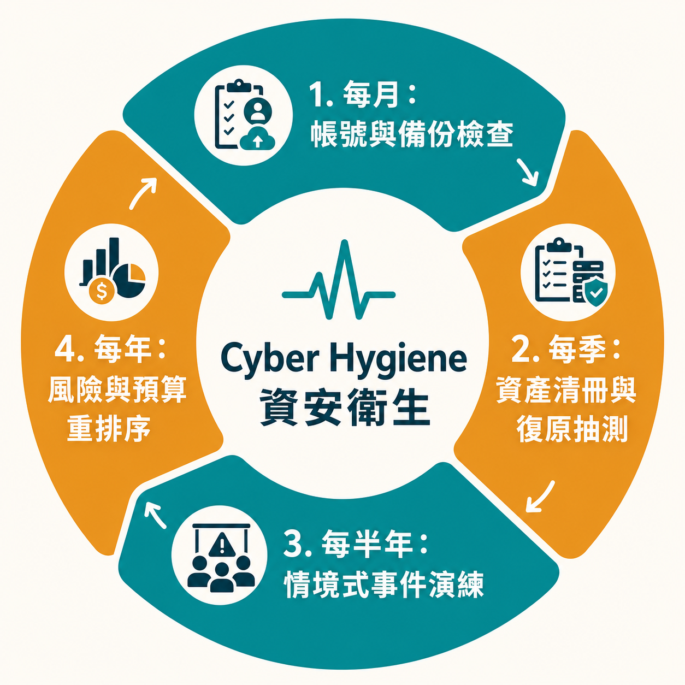

# 資安不是一次上完課：中小企業如何從自學、健檢走到專家輔導

> **課程定位**：Day1 資源導覽短講，由主辦單位代表介紹中小企業可使用的教材、自我檢查工具、客服與一對一專家諮詢。

很多中小企業並不是不想做資安，而是卡在一個更前面的問題：資料太多、術語太硬、預算有限，而且不知道第一步應該做什麼。

有人下載了一份厚厚的指引，翻兩頁就放回資料夾；有人做完檢核表，發現每一項都需要改善，反而更不知道怎麼排序；也有人直接找廠商買設備，最後才發現真正的問題是共用帳號、備份無法還原，或外包合約根本沒有約定事件責任。

這段課程提供的不是另一張「必買清單」，而是一條漸進路徑：**先用低門檻教材建立共同語言，再用工具看見自己的缺口，最後把企業特有的難題帶去和專家討論。**

## 摘要

> 本篇整理主辦單位介紹的資源導覽，核心是一條三層路徑：先用「資安心裡有術」等低門檻教材建立共同語言，再用基本防護指引與決策迷宮做自我檢查，最後把公司特有的難題帶進快速提問或專家會客室諮詢。文章也整理了檢核表的正確用法（排序而非成績單）、諮詢前該準備的五樣資料、以及用「資安衛生」概念維持每月到每年的持續節奏，最後提供一份四週最低門檻的入門版本。

## 三層學習路徑：知道、檢查、獲得協助

主辦單位把資源分成三類，剛好對應企業資安能力成長的三個階段。

### 第一層：自我學習

目標不是把同仁訓練成資安工程師，而是讓大家能理解帳號被盜、資料外洩、社交工程、委外風險與網路設定為何和日常工作有關。

這一層解決的是「聽不懂」與「不知道風險在哪裡」。如果主管、IT、採購、財務與一般使用者對資安使用完全不同的語言，制度很難落地。

### 第二層：應用工具與自我檢查

當企業理解基本概念後，下一步是把抽象觀念變成問題：是否仍有離職帳號？密碼是否共用？重要資料放在哪裡？備份能否還原？員工收到可疑訊息時知道找誰？

這一層解決的是「我知道資安重要，但不知道自己做得怎麼樣」。

### 第三層：真人諮詢與深度輔導

當問題涉及公司架構、預算、供應鏈、特定系統或曾發生的事件，通用教材不可能直接給出唯一答案。此時需要把資產、限制與目標帶進諮詢，讓專家協助排序。

這一層解決的是「每個建議都合理，但哪一個才適合我們」。

<svg id="my-svg" width="100%" xmlns="http://www.w3.org/2000/svg" xmlns:xlink="http://www.w3.org/1999/xlink" class="flowchart" style="max-width: 824px; background-color: transparent;" viewBox="0 0 824 118" role="graphics-document document" aria-roledescription="flowchart-v2"><g><marker id="my-svg_flowchart-v2-pointEnd" class="marker flowchart-v2" viewBox="0 0 10 10" refX="5" refY="5" markerUnits="userSpaceOnUse" markerWidth="8" markerHeight="8" orient="auto"><path d="M 0 0 L 10 5 L 0 10 z" class="arrowMarkerPath" style="stroke-width: 1; stroke-dasharray: 1, 0;"/></marker><marker id="my-svg_flowchart-v2-pointStart" class="marker flowchart-v2" viewBox="0 0 10 10" refX="4.5" refY="5" markerUnits="userSpaceOnUse" markerWidth="8" markerHeight="8" orient="auto"><path d="M 0 5 L 10 10 L 10 0 z" class="arrowMarkerPath" style="stroke-width: 1; stroke-dasharray: 1, 0;"/></marker><marker id="my-svg_flowchart-v2-circleEnd" class="marker flowchart-v2" viewBox="0 0 10 10" refX="11" refY="5" markerUnits="userSpaceOnUse" markerWidth="11" markerHeight="11" orient="auto"><circle cx="5" cy="5" r="5" class="arrowMarkerPath" style="stroke-width: 1; stroke-dasharray: 1, 0;"/></marker><marker id="my-svg_flowchart-v2-circleStart" class="marker flowchart-v2" viewBox="0 0 10 10" refX="-1" refY="5" markerUnits="userSpaceOnUse" markerWidth="11" markerHeight="11" orient="auto"><circle cx="5" cy="5" r="5" class="arrowMarkerPath" style="stroke-width: 1; stroke-dasharray: 1, 0;"/></marker><marker id="my-svg_flowchart-v2-crossEnd" class="marker cross flowchart-v2" viewBox="0 0 11 11" refX="12" refY="5.2" markerUnits="userSpaceOnUse" markerWidth="11" markerHeight="11" orient="auto"><path d="M 1,1 l 9,9 M 10,1 l -9,9" class="arrowMarkerPath" style="stroke-width: 2; stroke-dasharray: 1, 0;"/></marker><marker id="my-svg_flowchart-v2-crossStart" class="marker cross flowchart-v2" viewBox="0 0 11 11" refX="-1" refY="5.2" markerUnits="userSpaceOnUse" markerWidth="11" markerHeight="11" orient="auto"><path d="M 1,1 l 9,9 M 10,1 l -9,9" class="arrowMarkerPath" style="stroke-width: 2; stroke-dasharray: 1, 0;"/></marker><g class="root"><g class="clusters"/><g class="edgePaths"><path d="M196,59L200.167,59C204.333,59,212.667,59,220.333,59C228,59,235,59,238.5,59L242,59" id="L_a_b_0" class="edge-thickness-normal edge-pattern-solid edge-thickness-normal edge-pattern-solid flowchart-link" style=";" data-edge="true" data-et="edge" data-id="L_a_b_0" data-points="W3sieCI6MTk2LCJ5Ijo1OX0seyJ4IjoyMjEsInkiOjU5fSx7IngiOjI0NiwieSI6NTl9XQ==" marker-end="url(#my-svg_flowchart-v2-pointEnd)"/><path d="M506,59L510.167,59C514.333,59,522.667,59,530.333,59C538,59,545,59,548.5,59L552,59" id="L_b_c_0" class="edge-thickness-normal edge-pattern-solid edge-thickness-normal edge-pattern-solid flowchart-link" style=";" data-edge="true" data-et="edge" data-id="L_b_c_0" data-points="W3sieCI6NTA2LCJ5Ijo1OX0seyJ4Ijo1MzEsInkiOjU5fSx7IngiOjU1NiwieSI6NTl9XQ==" marker-end="url(#my-svg_flowchart-v2-pointEnd)"/></g><g class="edgeLabels"><g class="edgeLabel"><g class="label" data-id="L_a_b_0" transform="translate(0, 0)"><foreignObject width="0" height="0">

</foreignObject></g></g><g class="edgeLabel"><g class="label" data-id="L_b_c_0" transform="translate(0, 0)"><foreignObject width="0" height="0">

</foreignObject></g></g></g><g class="nodes"><g class="node default primary" id="flowchart-a-0" transform="translate(102, 59)"><rect class="basic label-container" style="fill:#DBEAFE !important;stroke:#1D4ED8 !important;stroke-width:2px !important" x="-94" y="-39" width="188" height="78"/><g class="label" style="color:#172554 !important" transform="translate(-64, -24)"><rect/><foreignObject width="128" height="48">

第一層：自我學習 建立共同語言

</foreignObject></g></g><g class="node default warning" id="flowchart-b-1" transform="translate(376, 59)"><rect class="basic label-container" style="fill:#FEF3C7 !important;stroke:#D97706 !important;stroke-width:2px !important" x="-130" y="-51" width="260" height="102"/><g class="label" style="color:#78350F !important" transform="translate(-100, -36)"><rect/><foreignObject width="200" height="72">

第二層：應用工具與自我檢查 看見自己的缺口

</foreignObject></g></g><g class="node default success" id="flowchart-c-3" transform="translate(686, 59)"><rect class="basic label-container" style="fill:#DCFCE7 !important;stroke:#15803D !important;stroke-width:2px !important" x="-130" y="-51" width="260" height="102"/><g class="label" style="color:#14532D !important" transform="translate(-100, -36)"><rect/><foreignObject width="200" height="72">

第三層：真人諮詢與深度輔導 把難題帶去和專家討論

</foreignObject></g></g></g></g></g></svg>

<svg id="my-svg" width="100%" xmlns="http://www.w3.org/2000/svg" xmlns:xlink="http://www.w3.org/1999/xlink" class="flowchart" style="max-width: 276px; background-color: transparent;" viewBox="0 0 276 398" role="graphics-document document" aria-roledescription="flowchart-v2"><g><marker id="my-svg_flowchart-v2-pointEnd" class="marker flowchart-v2" viewBox="0 0 10 10" refX="5" refY="5" markerUnits="userSpaceOnUse" markerWidth="8" markerHeight="8" orient="auto"><path d="M 0 0 L 10 5 L 0 10 z" class="arrowMarkerPath" style="stroke-width: 1; stroke-dasharray: 1, 0;"/></marker><marker id="my-svg_flowchart-v2-pointStart" class="marker flowchart-v2" viewBox="0 0 10 10" refX="4.5" refY="5" markerUnits="userSpaceOnUse" markerWidth="8" markerHeight="8" orient="auto"><path d="M 0 5 L 10 10 L 10 0 z" class="arrowMarkerPath" style="stroke-width: 1; stroke-dasharray: 1, 0;"/></marker><marker id="my-svg_flowchart-v2-circleEnd" class="marker flowchart-v2" viewBox="0 0 10 10" refX="11" refY="5" markerUnits="userSpaceOnUse" markerWidth="11" markerHeight="11" orient="auto"><circle cx="5" cy="5" r="5" class="arrowMarkerPath" style="stroke-width: 1; stroke-dasharray: 1, 0;"/></marker><marker id="my-svg_flowchart-v2-circleStart" class="marker flowchart-v2" viewBox="0 0 10 10" refX="-1" refY="5" markerUnits="userSpaceOnUse" markerWidth="11" markerHeight="11" orient="auto"><circle cx="5" cy="5" r="5" class="arrowMarkerPath" style="stroke-width: 1; stroke-dasharray: 1, 0;"/></marker><marker id="my-svg_flowchart-v2-crossEnd" class="marker cross flowchart-v2" viewBox="0 0 11 11" refX="12" refY="5.2" markerUnits="userSpaceOnUse" markerWidth="11" markerHeight="11" orient="auto"><path d="M 1,1 l 9,9 M 10,1 l -9,9" class="arrowMarkerPath" style="stroke-width: 2; stroke-dasharray: 1, 0;"/></marker><marker id="my-svg_flowchart-v2-crossStart" class="marker cross flowchart-v2" viewBox="0 0 11 11" refX="-1" refY="5.2" markerUnits="userSpaceOnUse" markerWidth="11" markerHeight="11" orient="auto"><path d="M 1,1 l 9,9 M 10,1 l -9,9" class="arrowMarkerPath" style="stroke-width: 2; stroke-dasharray: 1, 0;"/></marker><g class="root"><g class="clusters"/><g class="edgePaths"><path d="M138,86L138,90.167C138,94.333,138,102.667,138,110.333C138,118,138,125,138,128.5L138,132" id="L_a_b_0" class="edge-thickness-normal edge-pattern-solid edge-thickness-normal edge-pattern-solid flowchart-link" style=";" data-edge="true" data-et="edge" data-id="L_a_b_0" data-points="W3sieCI6MTM4LCJ5Ijo4Nn0seyJ4IjoxMzgsInkiOjExMX0seyJ4IjoxMzgsInkiOjEzNn1d" marker-end="url(#my-svg_flowchart-v2-pointEnd)"/><path d="M138,238L138,242.167C138,246.333,138,254.667,138,262.333C138,270,138,277,138,280.5L138,284" id="L_b_c_0" class="edge-thickness-normal edge-pattern-solid edge-thickness-normal edge-pattern-solid flowchart-link" style=";" data-edge="true" data-et="edge" data-id="L_b_c_0" data-points="W3sieCI6MTM4LCJ5IjoyMzh9LHsieCI6MTM4LCJ5IjoyNjN9LHsieCI6MTM4LCJ5IjoyODh9XQ==" marker-end="url(#my-svg_flowchart-v2-pointEnd)"/></g><g class="edgeLabels"><g class="edgeLabel"><g class="label" data-id="L_a_b_0" transform="translate(0, 0)"><foreignObject width="0" height="0">

</foreignObject></g></g><g class="edgeLabel"><g class="label" data-id="L_b_c_0" transform="translate(0, 0)"><foreignObject width="0" height="0">

</foreignObject></g></g></g><g class="nodes"><g class="node default primary" id="flowchart-a-0" transform="translate(138, 47)"><rect class="basic label-container" style="fill:#DBEAFE !important;stroke:#1D4ED8 !important;stroke-width:2px !important" x="-94" y="-39" width="188" height="78"/><g class="label" style="color:#172554 !important" transform="translate(-64, -24)"><rect/><foreignObject width="128" height="48">

第一層：自我學習 建立共同語言

</foreignObject></g></g><g class="node default warning" id="flowchart-b-1" transform="translate(138, 187)"><rect class="basic label-container" style="fill:#FEF3C7 !important;stroke:#D97706 !important;stroke-width:2px !important" x="-130" y="-51" width="260" height="102"/><g class="label" style="color:#78350F !important" transform="translate(-100, -36)"><rect/><foreignObject width="200" height="72">

第二層：應用工具與自我檢查 看見自己的缺口

</foreignObject></g></g><g class="node default success" id="flowchart-c-3" transform="translate(138, 339)"><rect class="basic label-container" style="fill:#DCFCE7 !important;stroke:#15803D !important;stroke-width:2px !important" x="-130" y="-51" width="260" height="102"/><g class="label" style="color:#14532D !important" transform="translate(-100, -36)"><rect/><foreignObject width="200" height="72">

第三層：真人諮詢與深度輔導 把難題帶去和專家討論

</foreignObject></g></g></g></g></g></svg>

圖：三層學習路徑，從建立共同語言、自我檢查缺口，到把企業特有難題帶去諮詢。

## 「資安心裡有術」：不是從術語開始，而是從企業情境開始

課程介紹由國家資通安全研究院編寫的「資安心裡有術」系列。它的設計重點，是讓沒有資訊或資安背景的人也能閱讀。與其先丟出一大串標準與縮寫，系列手冊透過案例、故事與名詞解釋，把風險放回日常決策。

逐字稿提到的選讀方向包括：

| 冊別／主題 | 適合的讀者問題 | 可以帶回公司的行動 |
| --- | --- | --- |
| 航程導引 | 五本都重要，我該先讀哪一本？ | 依角色與公司需求排出閱讀順序 |
| 資安基礎概論 | 資料外洩、帳號被盜與社交工程到底如何發生？ | 建立全員共同的基本語言 |
| 資通系統安全委外 | 網站、ERP 或會員系統交給廠商後，資安是誰的責任？ | 從需求、契約到驗收加入資安條件 |
| 網路安全設定 | Wi-Fi、防火牆、電子郵件與密碼可以先改善什麼？ | 盤點最常見、最貼近日常的設定問題 |
| 資安制度全攻略 | 做過一次改善後，如何持續下去？ | 建立角色、週期、紀錄與檢討機制 |

若公司只能先讀一本，基礎概論適合建立共識；若正準備委外開發，應優先看委外主題；若已經知道問題卻每年重演，制度與持續維運就更重要。

教材的真正用法不是「丟連結給同仁」。可以把每次內部會議聚焦在一個情境，例如離職帳號、釣魚信或廠商遠端維護，讀完相關段落後直接對照公司現況，產出一項改善工作。

## 影音課程適合複習，但要把觀看轉成任務

主辦單位說明，過往課程與本次 Day1、Day2 直播會保留在 YouTube，方便學員回看或分享給企業夥伴。這解決了現場資訊量過大、來不及抄筆記的問題。

不過「看過影片」不等於「組織具備能力」。比較有效的使用方法是把影片切成任務：

- 看完帳號管理段落，列出公司目前所有管理者帳號。
- 看完備份段落，實際抽一份備份做還原測試。
- 看完事件應變段落，確認緊急聯絡人是否仍有效。
- 看完委外風險段落，檢查現有合約是否有通報與蒐證責任。

學習成果要能在公司的清冊、設定、紀錄或演練中看見，否則只會停在個人印象。

## 基本資安防護指引：先確認三個基本面

課程介紹的中小企業基本資安防護指引，聚焦三大面向：帳戶管理、設備與資料管理、資安意識培育。這三類看似基礎，卻涵蓋多數企業最常見的起點。

### 帳戶管理

企業要知道誰有帳號、誰有管理權限、離職或調職後如何處理、共用帳號如何追查，以及重要服務是否只靠一組密碼。帳號管理若失控，再昂貴的設備也很難判斷「現在操作的人究竟是誰」。

### 設備與資料管理

需要盤點電腦、伺服器、手機、雲端服務、網路設備與重要資料。更新、備份、加密與存取權限都要有負責人。重點不是追求完美清單，而是先知道核心業務依賴哪些東西。

### 資安意識培育

員工要知道哪些行為有風險，以及發現疑慮時該向誰反映。若宣導只剩「不要亂點」，同仁碰到主管假冒信、臨時付款要求或陌生雲端分享時，仍然不知道如何判斷。

## 資安自檢決策迷宮：把規定變成看得見的後果

逐字稿示範了企業版決策迷宮：密碼是否貼在鍵盤附近、是否把密碼存進瀏覽器、是否把帳密寫在便條紙交給 IT、是否只用帳號密碼登入，以及看到「老闆」要求建立 LINE 群組時會不會立刻照辦。

這類工具的優點，是把枯燥的規定換成情境選擇。員工不只知道答案是「不可以」，還能理解後果：

- 密碼留在實體環境，任何靠近設備的人都可能取得。
- 把帳密交給 IT，讓責任與稽核軌跡變得模糊。
- 只有密碼，一旦遭釣魚就缺少第二層防護。
- 即時通訊裡的主管身分可能是假冒，急迫要求正是常見話術。

主辦單位另提供家庭版與青少年版，顯示資安教育不是只在公司發生。家庭帳號、社群平台與行動裝置一旦失守，也可能回頭影響工作帳號。

## 檢核表不是成績單，而是排序工具

第一次做自評時，出現大量缺口很正常。最危險的反應有兩種：一是為了好看而全部勾「已完成」；二是看到問題太多，乾脆全部不做。

比較務實的方式，是把每個缺口加上三個欄位：

1. **業務影響**：不改善會影響多少客戶、資料與營運？
2. **可利用程度**：是否對外、是否已有攻擊、是否容易被濫用？
3. **改善成本**：一週內可完成、需要跨部門，還是需要預算？

先處理高影響、容易被利用、又能快速改善的項目。這樣檢核表才是行動排序，而不是合規成績。

## 快速提問與深度諮詢，是兩種不同服務

課程介紹兩種協助管道。

第一種是透過資安署與經濟部中小及新創企業署相關服務管道，處理帳號管理、資產防護、釣魚與事件預防等較明確的問題。這適合快速釐清做法或尋找資源。

第二種是「中小企業資安專家會客室」，讓企業和專家進行較深入的一對一討論。依課程背景資訊，2026 年服務期間為 8 至 10 月，當時仍有名額。逐字稿列出的諮詢主題包括：

- 勒索軟體防護與復原。
- 企業機密資料保護。
- 資安管理與制度建立。

預約流程不是填完表單就立即得到標準答案。主辦單位會先檢視問題，必要時請企業補充資訊，再依議題媒合專家，透過線上或適合的實體方式討論，最後形成可行動的備忘錄。

課程背景提供的預約連結為：[中小企業資安專家會客室預約表單](https://forms.gle/3asPEqmpQzDJvK8X6)。名額與服務狀態仍以主辦單位最新公告為準。

## 諮詢前準備五樣資料，才能把時間用在刀口上

如果只帶著一句「我們想把資安做好」，專家還得先花大量時間理解公司。諮詢前可先準備：

1. **核心業務**：哪些服務停擺會立即影響收入或客戶？
2. **資產與資料**：重要系統、雲端服務、帳號與資料放在哪裡？
3. **目前控制**：備份、MFA、端點防護、委外維護做到什麼程度？
4. **已知問題**：曾發生哪些釣魚、病毒、帳號或設定事件？
5. **現實限制**：人力、預算、舊系統與不能停機的時段是什麼？

這些資料不需要一開始就完美。即使是一頁簡表，也能讓專家快速從「通用衛教」進入「公司怎麼做」。

## 資安衛生：真正有用的是持續的小循環

課程用 Cyber Hygiene，也就是資安衛生，說明資安和健康管理相似：一次上課、一次健檢或買一套產品，都不能保證永遠安全。攻擊方式會變、員工會異動、系統會更新，供應商也會更換。

可持續的企業節奏可以很簡單：

| 週期 | 建議行動 |
| --- | --- |
| 每月 | 檢查管理者帳號、重要告警與備份結果 |
| 每季 | 更新資產清冊、抽測復原、檢視廠商權限 |
| 每半年 | 做一次貼近公司情境的事件演練 |
| 每年 | 重新排序重大風險、預算與委外責任 |

資安能力不是一次跳到滿分，而是每一輪都比上一輪多看見一個問題、多關一個不必要入口、多驗證一次復原能力。

<figure class="infographic">
<picture>
<source media="(max-width: 760px)" srcset="images/02_cyber-hygiene-cycle-mobile.png">

</picture>
<figcaption>資安衛生是持續循環，不是一次性專案</figcaption>
</figure>

## 一家公司如何開始：四週最低門檻版本

**第一週：建立共同語言。** 選一份基礎教材與一段影音，讓主管、IT 與一位業務代表共同閱讀，列出最擔心的三種情境。

**第二週：完成小範圍自檢。** 只檢查管理者帳號、核心資料與備份，不追求一次做完整家公司。

**第三週：完成一項改善。** 例如停用離職帳號、替重要服務加上 MFA，或成功還原一份備份。

**第四週：決定是否需要外部協助。** 若卡在舊系統、供應商責任、勒索復原或制度建立，就把現況整理成問題，帶去快速諮詢或專家會客室。

這條路徑的核心不是「把教材全部看完」，而是讓每一份資源都對應到下一個實際行動。

## 結論

中小企業資安不需要一次到位，也不需要獨自摸索。從低門檻教材建立共識、用自我檢查看見缺口，到把特有難題帶去諮詢，是一條可以分階段完成的路徑；而資安衛生的持續節奏，讓這條路徑不會在完成一次改善後就停下來。

真正的行動門檻不是「有沒有時間看完所有資源」，而是「這次讀完、這次諮詢完，公司多做了哪一件事」。

---

## 來源與閱讀說明

- 課程影片：[115年中小企業基礎資安培訓課程｜第二期 Day1](https://www.youtube.com/watch?v=HaGctbSN7Dw)
- 完整逐字稿：[HackMD 課程逐字稿](https://hackmd.io/@lanss/r1r_aowEGx)
- 課程背景提供：[中小企業資安專家會客室預約表單](https://forms.gle/3asPEqmpQzDJvK8X6)

本文依課程逐字稿整理資源用途與導入方式；服務期間、名額與申請條件請以主辦單位最新公告為準。
