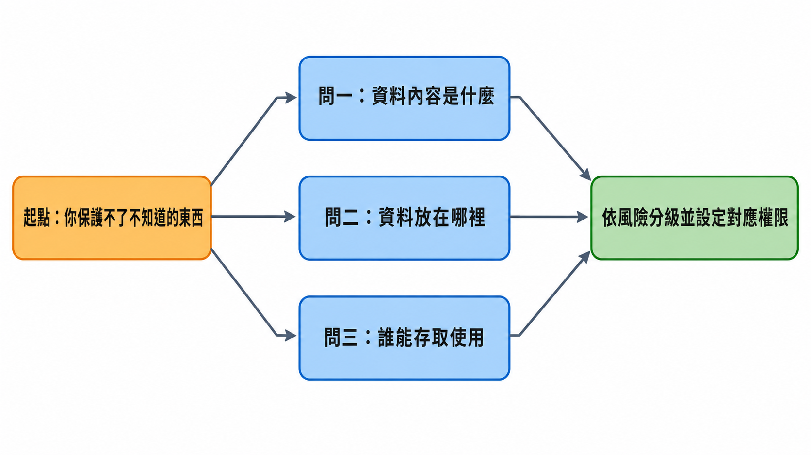
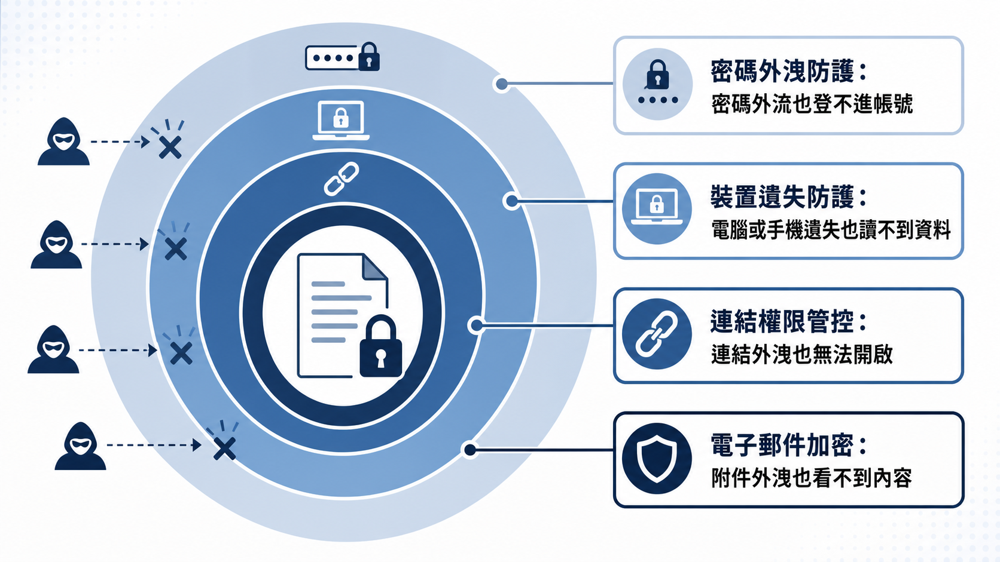

# 核心資料機密保護與風險防範機制（上）：從「我們公司太小不會被盯上」到資料盤點與帳號控管

> **課程定位**：Day2 上午主題課程，由崑山科技大學電腦與遊戲發展科學學士學位學程鄭郁翰副主任主講，聚焦企業核心資料的機密性保護與帳號權限管控，主題橫跨經營責任、資產盤點、分級授權與帳號管理常見漏洞。

「公司規模不大，不會被打吧？」「不會那麼倒楣吧？」——鄭郁翰老師在課程裡把這句話重複了好幾次，因為這正是他在中小企業現場最常聽到的僥倖心態。而他隨即點破：多數網路攻擊根本不是駭客坐在電腦前面一間一間公司挑，而是用自動化工具在網路上大海撈針，找到誰的防護薄弱，誰就中獎。中小企業資源少、人力薄，不是「不會被鎖定」的理由，反而是風險更高的原因。

更關鍵的是，資料外洩從來不需要「駭客入侵」這麼戲劇化的開場。一封記錯收件人的報價單、一個設定成「知道連結任何人都能看」的雲端資料夾、一個離職員工忘記關閉的帳號，都足以讓機密資料流出公司大門。這堂課要談的，正是這些看似瑣碎、卻佔了外洩案例絕大多數的日常操作風險，以及中小企業在預算有限的前提下，該如何抓出最該優先保護的東西。

## 摘要

> 資料外洩不是只有駭客攻擊才算數：email 寄錯對象、雲端連結設錯權限、離職員工帳號未停用，都構成資料外洩，而且發生頻率遠高於高深的駭客攻擊。企業一旦外洩，除了可能面對個資法裁罰與客戶求償（課堂引用「最高罰1500萬元」，未經外部覆核），還會產生訂單流失、供應鏈信任受損等長期無形衝擊。防護資源有限，不可能把所有資料都用最高規格保護，第一步永遠是資產盤點：釐清資料內容、存放地點、可存取對象這三個問題，再依風險高低分級授權。帳號管理則是資料存取的入口關卡，共用帳號、許可權過大、離職未停權、公私帳號混用，是中小企業最常見也最容易忽略的四個漏洞，多數都屬於管理疏失，而非技術問題。

## 資料外洩不是你以為的那樣：先問「我們有什麼不能被看到」

課程一開始，鄭郁翰老師沒有先講技術，而是丟出一個問題：公司裡有哪些資料絕對不能外洩？如果答案是「全部都不能外洩」，其實等於沒有回答——因為那是理想，不是可執行的防護策略。所有資料都用最高規格保護，成本會直接失控，就像消防或建築的耐震係數，要抗七級地震還是九級地震，成本天差地遠。中小企業的資源、預算和大型組織、跨國企業本來就不在同一個量級，做法自然也不該照搬。

因此，第一步永遠是釐清：哪些資料一旦外洩，衝擊最大？哪些資料外洩的機率最高？把資源押在「衝擊大、機率高」的交集上，才是中小企業務實的起點，也是這堂課後續所有內容的前提。

在講風險之前，鄭老師先重新定義了「外洩」這個詞——它比多數人想像的寬鬆得多。**只要不該看到的人看到了，理論上就構成資料外洩**，跟是不是駭客攻擊沒有必然關係。以往大家一想到外洩就聯想到駭客入侵、勒索軟體、電腦病毒，但實務上，很大比例的外洩來自日常操作：email 寄錯對象、雲端硬碟權限設定錯誤（例如誤設成「知道連結的人都可以看」）、員工用私人 Gmail 帳號處理公司業務且離職時無法追回。這些都不涉及高深技術，卻是最頻繁發生、也最容易被忽略的風險來源。

課程也引用了一項產業調查：資通設備大廠 Cisco 針對台灣市場中小企業的網路安全報告，指出過去有六成受訪企業表示曾遭遇網路攻擊（此為課堂引用數據，未經外部覆核）。老師進一步強調，真正造成外洩的主因，往往不是技術門檻高的駭客攻擊，而是社交工程、釣魚郵件與員工操作疏失——因為駭客也會算成本，低成本、高成功率的釣魚郵件遠比高深攻擊划算。

## 資料外洩如何拖累經營：從法律責任到無形資產受損

「資訊安全跟我們中小企業有什麼關係？」是老師點出的另一個常見誤解——資安離我們很遠、公司太小不需要注意。但他指出，資料保護已經是企業的法定責任：國內許多詐騙案件的源頭，正是不同企業的資料外洩，被有心人士拿去利用。

依現行個人資料保護法，企業若因資安維護不當導致個資外洩，除了主管機關可以裁罰之外，受害的當事人還可以另外提起求償或團體訴訟——也就是說，企業可能同時面對「被罰款」與「被告求償」兩條風險線。課程引用了 2023 年的一則新聞：非公務機關個資外洩，最高可罰新台幣 1500 萬元（此為課堂引用數據，未經外部覆核）。老師也舉了一個近期案例：某旅遊業者外洩約 20 萬份旅客護照個資，除了面對主管機關裁罰，還可能承受大量顧客求償與短期內的訂單信任流失（課堂案例，未經外部覆核）。

比罰款更難估算的，是資安事件對企業「無形資產」的長期侵蝕。一旦上了新聞，往後任何人搜尋這間公司都會看到當年的事件，就像食安風暴或個資外洩事件一樣，很難靠時間完全洗掉。更現實的是，供應鏈上下游客戶也可能要求企業落實資安責任、取得特定資安認證，資安維護不力甚至可能導致既有訂單斷裂。

老師把資訊安全的三個經典目標——機密性、完整性、可用性——簡單重新框給中小企業聽：機密性確保資料不被不該看的人看到，完整性確保資料不被竄改、維持一致與正確，可用性確保系統與資料在需要時可以正常使用（例如遭遇勒索軟體攻擊時的復原能力）。這堂課的重點鎖定在機密性，也涉及部分完整性議題。

外洩來源不只有外部駭客，課程整理成四類：**內部人員**（不論是不小心還是故意）、**管理流程**（制度性問題，例如沒有明確的分享與存取規範）、**系統技術面**（防火牆、入侵偵測、密碼強度、多因子驗證等）、**外部威脅**（惡意程式、駭客入侵、釣魚郵件）。老師特別提醒，許多單位習慣把資安事件都推給「基層人員操作疏失」，但很多其實是制度性問題——公司從流程面去改善，反而能有效降低因人為疏失導致外洩的機率。

## 資料盤點：你保護不了你不知道的東西

如果連公司內部到底有哪些資料、資訊裝置、資訊服務都不清楚，防護根本無從談起。鄭老師用一句話濃縮了這個邏輯：**你保護不了你不知道的東西。**

資料盤點的目的有兩個：第一，掌握企業內部資料的全貌——有哪些類型的資料、是電子化還是紙本、放在什麼地方、誰能存取得到；第二，識別哪些資料或存放地點屬於高風險，作為後續管控與保護資源分配的依據。

具體做法可以簡化成三個問題，逐一釐清每一筆重要資料：

<figure class="infographic">
<picture>
<source media="(max-width: 760px)" srcset="images/01_data-inventory-flow-mobile.png">

</picture>
<figcaption>先知道資料是什麼、在哪裡、誰能使用，才有辦法依風險配置保護</figcaption>
</figure>

第二個問題「放在什麼地方」，實務上往往比想像中分散：同一份資料可能同時存在於系統資料庫、匯出的 Excel 檔、雲端硬碟連結、對方的信箱，甚至隨身碟裡。分散不一定是錯，因為備份本身就需要多點存放，但每多一個存放地點，就多一處需要落實保護的節點——這是取捨，不是免費的。

盤點也要留意「影子 IT」：部門或個人在資訊單位不知情的狀況下，自行採購或使用未經公司核准的資訊服務（例如把公司文件丟上網路上找到的 AI 工具去生成內容）。這類資料公司完全沒有掌握，一旦外洩，公司往往是最後一個知道的。

盤點不必一步到位，可以用滾動式的方式進行——先抓大方向，每三到六個月盤一次、補齊遺漏，資料的存放樣態本來就會隨業務調整而改變。盤點完成之後，真正產生防護效果的是下一步：**針對找出的脆弱點施加控制措施**。單純盤點本身並不會提升防護力道，它只是讓你知道要保護什麼，接下來還是要具體落地。

## 分級授權與資料標籤化：不是所有資料都值得同一種待遇

盤點完成後，下一步是依資料的重要性與敏感程度分級，常見的簡易做法是機密級、內部級、商業級、公開級四個等級。老師特別提醒一個容易被忽略的觀念：**公開級資料不等於不需要保護**。網站上公開的資訊雖然不怕外洩，但仍然可能被竄改——標價被亂改、被掛上不當內容，同樣會對企業形象造成衝擊，只是保護的面向從「防外流」變成「防竄改」。

分級之後，還要搭配授權設定，決定誰能看、誰能下載、誰能編輯、誰能外傳。老師提到一個常被忽略的細節：多數雲端硬碟服務（例如 Google 雲端硬碟）在對方申請存取權限時，預設欄位常停留在「編輯者」，如果沒特別注意就直接核准，等於把可以任意修改內容的權限送出去了。實務建議是能用「檢視者」就不要給「編輯者」，能設定到期日就設定到期日，避免因為忘記收回權限而讓連結長期外洩曝險。

另一個成本很低、效果卻很直接的做法是**資料標籤化**：在檔名、文件封面或電子郵件標題加註「機密」「內部限閱」「請勿外傳」等字樣，讓使用者一眼就能判斷資料的敏感程度，降低誤傳、誤分享的機率。這類作法幾乎不涉及技術成本，卻能提醒每一個經手資料的人多想一秒。

<figure class="infographic">
<picture>
<source media="(max-width: 760px)" srcset="images/01_defense-layers-mobile.png">

</picture>
<figcaption>單一防線失守不等於全面失守：四道控制共同保護敏感資料</figcaption>
</figure>

當敏感資料需要對外分享或做進一步分析時，鄭老師介紹了兩種降低曝險的技術：**假名化**（把姓名替換成識別碼，例如「王小明」變成「P001」，仍可透過另存的對照表還原，適合日後仍需追蹤當事人的情境）與**去識別化／匿名化**（移除欄位、遮罩、泛化成區間，例如把精確年齡改成「20-29 歲」，目的是讓資料不容易再對應回特定人）。他也提醒，去識別化做得不夠徹底一樣沒用——欄位留太多、太獨特（例如「某公司某部門經理」），仍然可能被重新識別回同一個人身上，去識別化因此是「降低風險」而非「保證安全」。

## 帳號與權限管理：常見風險多半是管理疏失，不是技術問題

帳號是多數資料存取的入口，一旦管理不當，出事之後往往很難追查真正的來源。老師整理出中小企業最常見的四類帳號風險：

**共用帳號**：多名員工共用同一組帳號登入系統或社群平台管理後台，看似方便，實則讓「誰做的」永遠查不清楚。密碼外流時，責任也無法歸屬到特定個人，員工異動時還得牽動所有共用者重新設定密碼，徒增管理負擔。老師強調，讓帳號綁定到自然人身上，本身就是一種「嚇阻型」控制措施——員工知道自己的每一步操作都留有記錄，行為自然會更謹慎。

**許可權過大**：許多帳號的權限設定只是為了「管理方便」，一次給到位之後就不再調整，導致員工擁有遠超過工作所需的存取範圍。建議原則是最小權限，若某項功能只在特定時間點才需要用到（例如年底或臨時稽核），可以透過申請流程臨時授權，而非長期開放。

**離職或調職未即時停權**：員工離職後帳號未關閉，仍可登入系統甚至用公司信箱與客戶聯繫；調職後舊職務的權限沒有一併收回，也可能造成一人同時掌握不該同時擁有的多項權限（例如既能管錢又能管帳）。課程也提到近期一則新聞：某大學專員遭解僱、帳號被停用後，利用信箱服務的「忘記密碼」功能重新取得帳號控制權，刪除業務資料（課堂引用之近期新聞案例，未經外部覆核）——顯示單純停用帳號未必足夠，還需要留意密碼救援機制是否也一併阻斷。

**個人帳號與公司帳號混用**：用私人 Gmail 處理公司業務，或反過來用公司帳號註冊私人服務，都會讓資料所有權與管理責任變得模糊。員工離職後，留在私人信箱裡的公司資料幾乎無法追回；而公司帳號若被用在外部服務，一旦密碼與內部系統相同，等於多開了一個攻擊入口。

這些漏洞的共通點是：多半不需要高深技術即可修補，真正需要的是明確的管理制度與落實的執行力。老師特別提醒，資安不該被視為「找 IT 部門解決」的專屬課題——一封寄錯地址的 email，責任不在資訊人員，而是每一位經手資料的員工都該具備的基本判斷力。

## 結論

這堂課反覆點破一個核心誤解：資料外洩不是駭客電影裡的戲劇化場景，而是日常操作中一次寄錯的信、一個設錯的雲端權限、一個忘記關閉的離職帳號。中小企業資源有限，不可能把所有資料都用最高規格保護，因此第一步必須是資產盤點——釐清資料內容、存放地點、可存取對象，才知道防護的資源該押在哪裡。盤點之後的分級授權與標籤化，讓保護力道能依風險高低分配，而不是齊頭式地耗盡預算。至於帳號管理常見的共用帳號、許可權過大、離職未停權、公私混用，本質上都是管理疏失，不是技術門檻問題——這也意味著，多數中小企業不需要昂貴設備，就能從制度與流程面先把最基本的防線補起來。

---

## 名詞速查

- **機密性 / 完整性 / 可用性**：資訊安全的三個經典目標，分別對應「不被看到」「不被竄改」「持續可用」，本文聚焦機密性與部分完整性。
- **資料盤點**：釐清企業有哪些資料、存放在哪裡、誰能存取，是所有後續防護措施的前提。
- **假名化**：將識別欄位替換成代碼，並透過另存對照表保留還原能力，適合仍需追蹤當事人的情境。
- **去識別化／匿名化**：透過移除欄位、遮罩、泛化等方式，降低資料被重新對應回特定人的風險，但無法保證絕對無法還原。
- **影子 IT**：部門或員工在資訊單位不知情下自行採購、使用的未經核准資訊服務，公司對其中的資料完全沒有掌握與防護。
- **最小權限原則**：帳號只給予工作實際需要的存取範圍，超出範圍的權限應透過臨時申請流程取得，而非長期開放。
- **雙重勒索攻擊**：勒索軟體攻擊者除了加密鎖住資料，還會事先竊取資料副本，即使受害者靠備份復原檔案，仍可能面臨資料被公開外洩的二次威脅。

## 來源與閱讀說明

- 完整逐字稿：[HackMD 課程逐字稿（上午）](https://hackmd.io/@lanss/S19ZY6_4Mx)

本文依課程逐字稿整理改寫，文中引用之調查數據、罰款金額與新聞案例（如 Cisco 六成受訪中小企業遭網路攻擊、個資法最高罰 1500 萬元、旅遊業者 20 萬份護照個資外洩、大學專員刪除業務資料案例等）均為課堂引用內容，未經本文外部查核，實際數字與案件細節請以原始新聞或主管機關公告為準。
