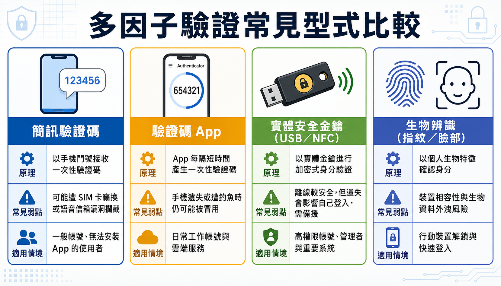

# 密碼不是不夠強，是這個機制本身不夠用：從多因子驗證到把資安變成反射動作

> **課程定位**：115年中小企業基礎資安培訓課程 第二期 Day2，「核心資料機密保護與風險防範機制」下半，講師鄭郁翰副主任（崑山科技大學電腦與遊戲發展科學學士學位學程）。

有一間公司發現，某個員工的帳號在凌晨十二點登入，下載了訂單資料。員工下班了，登入的不是他。公司要對這名員工究責，員工說「我也是受害者」——這下變成了一場各說各話的無頭公案：公司不知道該向誰求償，員工不知道自己做錯了什麼。

問題的根源很簡單：帳號是一切資料保護的入口，而多數企業唯一守住這道入口的機制，只有一組密碼。密碼會被記錄、被猜中、被騙走、被拿去對照外洩資料庫——它從來不是一個可靠的身份證明，只是一個「知道某段字串的人」的證明。這篇文章要說的，不是把密碼設得更複雜，而是為什麼密碼這個機制本身已經走到極限，以及企業該怎麼把補強措施真正落實下去，而不只是寫進一份沒人看的規範。

## 摘要

> 密碼只能證明「有人輸入了正確的字串」，不能證明操作的是本人；一旦外洩、被猜中或遭撞庫攻擊，攻擊者就能以受害者的身份行事，而受害員工往往百口莫辯。本文說明為什麼密碼機制先天不足，介紹多因子驗證（MFA）如何用知識、持有、生物特徵三種不同型別的證明疊加來補強，並整理企業導入 MFA 的實務順序、密碼管理器的取捨、以及以真實案例呈現的 LINE 帳號盜用手法。文章後段說明企業如何把這些技術措施轉成可執行的管理制度、日常操作習慣、事件通報機制，最終融入日常工作流程成為員工的反射動作，而不是另一份沒人理會的規定。

## 帳號是資料保護的入口，密碼卻是最脆弱的守門員

企業的資料保護，最終都要回到一個問題：系統怎麼確認眼前操作的人真的是他自稱的那個人。這件事叫身份認證，而密碼是最簡便、也最便宜的做法——同時也是最不安全的做法。

密碼之所以先天不足，是因為它單純依賴「你知道的一段字串」，而人的記憶有限，所以會出現幾個必然的後果：密碼設得簡單、密碼重複使用、密碼很久不換。這些習慣讓密碼可以透過多種管道被取得——釣魚郵件騙你交出來、社交工程騙你講出來、鍵盤側錄程式偷走你打的字、瀏覽器裡存的密碼被撈走，或是直接用工具暴力破解太短太弱的密碼。更麻煩的是，密碼遺失你未必馬上知道：對方登入過你的帳號，系統若沒有告警，你完全不會發現。

密碼還有一個結構性風險：一旦某個小網站的帳密資料庫外洩，攻擊者會假設多數人習慣不同網站用同一組帳密，於是自動化工具會把外洩的帳密清單拿去逐一嘗試登入其他網站——這就是撞庫攻擊。它不需要駭客特別針對你，純粹是機率遊戲：外洩清單越大，撞中的人數就越多。防禦撞庫攻擊最直接的做法有兩個，一是不同網站不要共用密碼，二是替重要帳號啟用多因子驗證，讓攻擊者就算撞中密碼，也無法直接登入。

密碼設定上有幾個實務要點值得記住：長度比複雜度更重要（近年建議至少 15 字元以上，早期常見的 8 字元標準已經過時）；避免生日、身份證字號等容易被猜出模式的組合（台灣人常見的設定模式，其實攻擊者也很清楚）；中文注音或倉頡輸入法當密碼看似安全，但常見組合早已被收錄進密碼猜測字典；不同重要程度的帳號應該用不同強度與唯一性的密碼——電子郵件與雲端服務帳號因為可以重設其他服務的密碼，重要性通常最高，需要特別強化。

## 多因子驗證：不要只靠一種型別的證明

如果只用一種驗證方式，不論是哪一種，都有各自的破口：只用密碼會被偷、被拆、被外洩；只用卡片會被偷、被偽造；只用生物特徵也有辨識錯誤或非自願情況下被迫使用的風險。多因子驗證（MFA）的核心邏輯，不是疊加更多同類型的關卡，而是混搭不同型別的證明方式，讓單一管道失守後還有另一道機制擋著。

常見的驗證因子分成三種型別：

- **知識因子**：你知道的事，例如密碼、PIN 碼。
- **持有因子**：你擁有的東西，例如手機、實體安全金鑰、金融卡。
- **生物因子**：你與生俱來的特徵，例如指紋、臉部辨識、虹膜。

（有些場域還會用「環境因子」補強，例如限制只能從公司內部 IP 登入，等同把「在特定實體位置」也當成一種持有性質的證明；某些高風險但無法中斷作業的場所，也可能改用門禁與警衛作為替代的身份確認機制，重點是原則一致：不要只依賴單一型別的驗證。）

只要把兩種不同型別混搭在一起，就能大幅降低單一機制被攻破的風險——密碼被偷了沒關係，只要對方沒有你的手機或指紋，還是進不去。這也是為什麼 MFA 對中小企業來說格外划算：多數企業已經在使用的雲端服務，像是 Google Workspace、微軟 O365，以及 LINE、Facebook、多數銀行與電商平台，其實內建就有可以啟用的多因子驗證功能，成本幾乎是零，只是「你沒有啟用而已」。

<figure class="infographic">
<picture>
<source media="(max-width: 760px)" srcset="images/02_mfa-comparison-mobile.png">

</picture>
<figcaption>四種常見 MFA 各有便利性、安全性與備援需求上的取捨</figcaption>
</figure>

多因子驗證能對抗的典型情境包括：釣魚郵件騙走帳密後，攻擊者仍卡在第二關（插入安全金鑰或輸入手機驗證碼）進不去；密碼因為重複使用而在其他網站外洩，只要重要帳號有 MFA，還有一道防線擋著。但每一種 MFA 機制也各有弱點，沒有零缺陷的做法，這也是混搭型別的意義所在。簡訊驗證碼可能被攔截，國外已發生過攻擊者持偽造身份資料到門市補辦 SIM 卡、藉此收取驗證簡訊的案例；免費的驗證碼 App、登入推播確認、硬體安全金鑰或指紋掃描，各自在便利性、成本與安全等級上有不同取捨，企業應依重要程度選擇可負擔又可行的組合。

啟用實體安全金鑰這類機制時，務必考慮可用性：金鑰遺失，連本人都登不進去。建議至少準備多把備援金鑰分開存放，並保留簡訊等其他備援管道，避免把自己也擋在門外。

## LINE 帳號怎麼在「什麼都沒做」的情況下被盜

多因子驗證的價值，在真實社交工程案例裡看得最清楚。LINE 是台灣最常用的通訊軟體之一，最基本的登入方式是輸入手機號碼，再輸入簡訊收到的驗證碼——本質上仍是「你有 SIM 卡就能登入」，屬於單一持有型別的驗證，並不算真正的多因子驗證。

常見的盜用手法是典型的社交工程：攻擊者用假冒 LINE 投票或領取免費貼圖的頁面，誘騙使用者輸入帳號密碼，取得帳密後立即嘗試登入，同時要求使用者在下一個假頁面中輸入手機收到的驗證碼——受害者以為自己在完成「投票驗證」，其實是把驗證碼親手交給了攻擊者，等於幫攻擊者補齊了第二道關卡。

另一種更少見但同樣真實的案例，是攻擊者利用電信業者語音信箱的預設密碼（未更改的門號預設密碼）取得語音留言，藉此聽取原本應以簡訊發送、但因未接聽而改以語音方式留下的驗證碼——不需要騙受害者任何一步，純粹是繞過設計上的預設弱點。

這類事件說明一件事：帳號被盜不代表使用者做錯了什麼明顯的事，很多時候問題出在系統設計的預設值，或是社交工程包裝得極其自然。啟用更高等級的多因子驗證，等於在使用者沒有意識到風險的情況下，多了一層系統性的防護。

## 密碼管理器：解決記憶問題，但別把所有雞蛋放進同一個籃子

密碼管理器的存在，正是為了解決「密碼要設不同、要夠複雜、又不能寫下來」這個必然導致遺忘的矛盾。它的核心價值是降低重複密碼的風險，同時讓使用者不必因為怕忘記而妥協成簡單密碼。多數瀏覽器內建的密碼管理功能、以及市面上的付費或免費工具，都能自動產生高強度隨機密碼並在登入時自動填入。

但密碼管理器本身也是一個集中風險點：一旦裡面存放了兩百組密碼，這道門本身就變成一個高價值、高風險的目標，需要用高強度密碼與多因子驗證額外保護。雲端同步型的密碼管理器（例如透過雲端帳號在手機與電腦間同步密碼）雖然方便，但代價是雲端帳號一旦被盜，影響範圍就是所有同步的密碼，等於把風險集中放大；本地端管理器則沒有這個集中風險，但犧牲了跨裝置的便利性。企業應該依自身風險承受能力決定採用雲端或本地方案，並要求員工遵循統一政策，而不是各自為政。

## 從個人防護到組織強制：MFA 怎麼真正落地

多數企業並非不知道 MFA 存在，而是「知道但沒有強制啟用」。啟用 MFA 若只靠宣導、要求員工自行去後台設定，效果通常有限——员工會選擇對自己最方便的路徑。真正有效的做法，是管理者從系统後台強制要求全公司帳號啟用，而不是被動等待員工自發配合。

導入順序上，建議優先從高風險、高價值的帳號著手：管理者帳號、雲端服務與電子郵件帳號、對外服務系統，這些平台多半本身就內建 MFA 功能，啟用幾乎不需要額外預算。相對地，公司內部自行開發或採購建置的系統，才可能牽涉到程式碼修改的成本，需要另外評估。

強制導入時常見的阻力包括：員工覺得麻煩、不會操作、擔心影響作業效率，甚至有人會以「公司規模小、用不到」為由抗拒。因應方式對應也很明確——需要高階主管的支持與背書、需要教育訓練讓員工知道怎麼操作、需要優先處理重要業務再逐步擴大範圍。也必須考慮特殊情境：某些需要立即反應的場合（例如需要快速處理緊急狀況的作業環境），強制手機驗證可能造成延誤，這類場合可以考慮替代的身份確認機制，而非完全放棄防護。

還有一個容易被忽略但很現實的難題：如果公司要求全員啟用 MFA，唯獨負責人或老闆本人拒絕配合，恰恰是風險最高的那個帳號留下了缺口——這需要組織內部的溝通與堅持，而不只是技術問題。

## 把資安變成日常反射動作，而不是額外的一份清單

技術措施再多，若沒有真正落實到組織的日常運作裡，就只是紙上談兵。許多企業的資安失敗，並非因為沒有技術方案，而是因為沒有把方案變成制度、把制度變成習慣。落實資安文化，可以從四個彼此銜接的面向著手。

<svg id="my-svg" width="100%" xmlns="http://www.w3.org/2000/svg" xmlns:xlink="http://www.w3.org/1999/xlink" class="flowchart" style="max-width: 1014px; background-color: transparent;" viewBox="0 0 1014 94" role="graphics-document document" aria-roledescription="flowchart-v2"><g><marker id="my-svg_flowchart-v2-pointEnd" class="marker flowchart-v2" viewBox="0 0 10 10" refX="5" refY="5" markerUnits="userSpaceOnUse" markerWidth="8" markerHeight="8" orient="auto"><path d="M 0 0 L 10 5 L 0 10 z" class="arrowMarkerPath" style="stroke-width: 1; stroke-dasharray: 1, 0;"/></marker><marker id="my-svg_flowchart-v2-pointStart" class="marker flowchart-v2" viewBox="0 0 10 10" refX="4.5" refY="5" markerUnits="userSpaceOnUse" markerWidth="8" markerHeight="8" orient="auto"><path d="M 0 5 L 10 10 L 10 0 z" class="arrowMarkerPath" style="stroke-width: 1; stroke-dasharray: 1, 0;"/></marker><marker id="my-svg_flowchart-v2-circleEnd" class="marker flowchart-v2" viewBox="0 0 10 10" refX="11" refY="5" markerUnits="userSpaceOnUse" markerWidth="11" markerHeight="11" orient="auto"><circle cx="5" cy="5" r="5" class="arrowMarkerPath" style="stroke-width: 1; stroke-dasharray: 1, 0;"/></marker><marker id="my-svg_flowchart-v2-circleStart" class="marker flowchart-v2" viewBox="0 0 10 10" refX="-1" refY="5" markerUnits="userSpaceOnUse" markerWidth="11" markerHeight="11" orient="auto"><circle cx="5" cy="5" r="5" class="arrowMarkerPath" style="stroke-width: 1; stroke-dasharray: 1, 0;"/></marker><marker id="my-svg_flowchart-v2-crossEnd" class="marker cross flowchart-v2" viewBox="0 0 11 11" refX="12" refY="5.2" markerUnits="userSpaceOnUse" markerWidth="11" markerHeight="11" orient="auto"><path d="M 1,1 l 9,9 M 10,1 l -9,9" class="arrowMarkerPath" style="stroke-width: 2; stroke-dasharray: 1, 0;"/></marker><marker id="my-svg_flowchart-v2-crossStart" class="marker cross flowchart-v2" viewBox="0 0 11 11" refX="-1" refY="5.2" markerUnits="userSpaceOnUse" markerWidth="11" markerHeight="11" orient="auto"><path d="M 1,1 l 9,9 M 10,1 l -9,9" class="arrowMarkerPath" style="stroke-width: 2; stroke-dasharray: 1, 0;"/></marker><g class="root"><g class="clusters"/><g class="edgePaths"><path d="M228,47L232.167,47C236.333,47,244.667,47,252.333,47C260,47,267,47,270.5,47L274,47" id="L_A_B_0" class="edge-thickness-normal edge-pattern-solid edge-thickness-normal edge-pattern-solid flowchart-link" style=";" data-edge="true" data-et="edge" data-id="L_A_B_0" data-points="W3sieCI6MjI4LCJ5Ijo0N30seyJ4IjoyNTMsInkiOjQ3fSx7IngiOjI3OCwieSI6NDd9XQ==" marker-end="url(#my-svg_flowchart-v2-pointEnd)"/><path d="M498,47L502.167,47C506.333,47,514.667,47,522.333,47C530,47,537,47,540.5,47L544,47" id="L_B_C_0" class="edge-thickness-normal edge-pattern-solid edge-thickness-normal edge-pattern-solid flowchart-link" style=";" data-edge="true" data-et="edge" data-id="L_B_C_0" data-points="W3sieCI6NDk4LCJ5Ijo0N30seyJ4Ijo1MjMsInkiOjQ3fSx7IngiOjU0OCwieSI6NDd9XQ==" marker-end="url(#my-svg_flowchart-v2-pointEnd)"/><path d="M768,47L772.167,47C776.333,47,784.667,47,792.333,47C800,47,807,47,810.5,47L814,47" id="L_C_D_0" class="edge-thickness-normal edge-pattern-solid edge-thickness-normal edge-pattern-solid flowchart-link" style=";" data-edge="true" data-et="edge" data-id="L_C_D_0" data-points="W3sieCI6NzY4LCJ5Ijo0N30seyJ4Ijo3OTMsInkiOjQ3fSx7IngiOjgxOCwieSI6NDd9XQ==" marker-end="url(#my-svg_flowchart-v2-pointEnd)"/></g><g class="edgeLabels"><g class="edgeLabel"><g class="label" data-id="L_A_B_0" transform="translate(0, 0)"><foreignObject width="0" height="0">

</foreignObject></g></g><g class="edgeLabel"><g class="label" data-id="L_B_C_0" transform="translate(0, 0)"><foreignObject width="0" height="0">

</foreignObject></g></g><g class="edgeLabel"><g class="label" data-id="L_C_D_0" transform="translate(0, 0)"><foreignObject width="0" height="0">

</foreignObject></g></g></g><g class="nodes"><g class="node default primary" id="flowchart-A-0" transform="translate(118, 47)"><rect class="basic label-container" style="fill:#DBEAFE !important;stroke:#1D4ED8 !important;stroke-width:2px !important" x="-110" y="-39" width="220" height="78"/><g class="label" style="color:#172554 !important" transform="translate(-80, -24)"><rect/><foreignObject width="160" height="48">

制定管理制度 帳號、密碼、離職流程

</foreignObject></g></g><g class="node default warning" id="flowchart-B-1" transform="translate(388, 47)"><rect class="basic label-container" style="fill:#FEF3C7 !important;stroke:#D97706 !important;stroke-width:2px !important" x="-110" y="-39" width="220" height="78"/><g class="label" style="color:#78350F !important" transform="translate(-80, -24)"><rect/><foreignObject width="160" height="48">

強化員工日常操作習慣 教育訓練、反覆演練

</foreignObject></g></g><g class="node default warning" id="flowchart-C-3" transform="translate(658, 47)"><rect class="basic label-container" style="fill:#FEF3C7 !important;stroke:#D97706 !important;stroke-width:2px !important" x="-110" y="-39" width="220" height="78"/><g class="label" style="color:#78350F !important" transform="translate(-80, -24)"><rect/><foreignObject width="160" height="48">

建立事件通報機制 疑似異常先通報再判斷

</foreignObject></g></g><g class="node default success" id="flowchart-D-5" transform="translate(912, 47)"><rect class="basic label-container" style="fill:#DCFCE7 !important;stroke:#15803D !important;stroke-width:2px !important" x="-94" y="-39" width="188" height="78"/><g class="label" style="color:#14532D !important" transform="translate(-64, -24)"><rect/><foreignObject width="128" height="48">

融入日常工作流程 成為反射動作

</foreignObject></g></g></g></g></g></svg>

<svg id="my-svg" width="100%" xmlns="http://www.w3.org/2000/svg" xmlns:xlink="http://www.w3.org/1999/xlink" class="flowchart" style="max-width: 236px; background-color: transparent;" viewBox="0 0 236 478" role="graphics-document document" aria-roledescription="flowchart-v2"><g><marker id="my-svg_flowchart-v2-pointEnd" class="marker flowchart-v2" viewBox="0 0 10 10" refX="5" refY="5" markerUnits="userSpaceOnUse" markerWidth="8" markerHeight="8" orient="auto"><path d="M 0 0 L 10 5 L 0 10 z" class="arrowMarkerPath" style="stroke-width: 1; stroke-dasharray: 1, 0;"/></marker><marker id="my-svg_flowchart-v2-pointStart" class="marker flowchart-v2" viewBox="0 0 10 10" refX="4.5" refY="5" markerUnits="userSpaceOnUse" markerWidth="8" markerHeight="8" orient="auto"><path d="M 0 5 L 10 10 L 10 0 z" class="arrowMarkerPath" style="stroke-width: 1; stroke-dasharray: 1, 0;"/></marker><marker id="my-svg_flowchart-v2-circleEnd" class="marker flowchart-v2" viewBox="0 0 10 10" refX="11" refY="5" markerUnits="userSpaceOnUse" markerWidth="11" markerHeight="11" orient="auto"><circle cx="5" cy="5" r="5" class="arrowMarkerPath" style="stroke-width: 1; stroke-dasharray: 1, 0;"/></marker><marker id="my-svg_flowchart-v2-circleStart" class="marker flowchart-v2" viewBox="0 0 10 10" refX="-1" refY="5" markerUnits="userSpaceOnUse" markerWidth="11" markerHeight="11" orient="auto"><circle cx="5" cy="5" r="5" class="arrowMarkerPath" style="stroke-width: 1; stroke-dasharray: 1, 0;"/></marker><marker id="my-svg_flowchart-v2-crossEnd" class="marker cross flowchart-v2" viewBox="0 0 11 11" refX="12" refY="5.2" markerUnits="userSpaceOnUse" markerWidth="11" markerHeight="11" orient="auto"><path d="M 1,1 l 9,9 M 10,1 l -9,9" class="arrowMarkerPath" style="stroke-width: 2; stroke-dasharray: 1, 0;"/></marker><marker id="my-svg_flowchart-v2-crossStart" class="marker cross flowchart-v2" viewBox="0 0 11 11" refX="-1" refY="5.2" markerUnits="userSpaceOnUse" markerWidth="11" markerHeight="11" orient="auto"><path d="M 1,1 l 9,9 M 10,1 l -9,9" class="arrowMarkerPath" style="stroke-width: 2; stroke-dasharray: 1, 0;"/></marker><g class="root"><g class="clusters"/><g class="edgePaths"><path d="M118,86L118,90.167C118,94.333,118,102.667,118,110.333C118,118,118,125,118,128.5L118,132" id="L_A_B_0" class="edge-thickness-normal edge-pattern-solid edge-thickness-normal edge-pattern-solid flowchart-link" style=";" data-edge="true" data-et="edge" data-id="L_A_B_0" data-points="W3sieCI6MTE4LCJ5Ijo4Nn0seyJ4IjoxMTgsInkiOjExMX0seyJ4IjoxMTgsInkiOjEzNn1d" marker-end="url(#my-svg_flowchart-v2-pointEnd)"/><path d="M118,214L118,218.167C118,222.333,118,230.667,118,238.333C118,246,118,253,118,256.5L118,260" id="L_B_C_0" class="edge-thickness-normal edge-pattern-solid edge-thickness-normal edge-pattern-solid flowchart-link" style=";" data-edge="true" data-et="edge" data-id="L_B_C_0" data-points="W3sieCI6MTE4LCJ5IjoyMTR9LHsieCI6MTE4LCJ5IjoyMzl9LHsieCI6MTE4LCJ5IjoyNjR9XQ==" marker-end="url(#my-svg_flowchart-v2-pointEnd)"/><path d="M118,342L118,346.167C118,350.333,118,358.667,118,366.333C118,374,118,381,118,384.5L118,388" id="L_C_D_0" class="edge-thickness-normal edge-pattern-solid edge-thickness-normal edge-pattern-solid flowchart-link" style=";" data-edge="true" data-et="edge" data-id="L_C_D_0" data-points="W3sieCI6MTE4LCJ5IjozNDJ9LHsieCI6MTE4LCJ5IjozNjd9LHsieCI6MTE4LCJ5IjozOTJ9XQ==" marker-end="url(#my-svg_flowchart-v2-pointEnd)"/></g><g class="edgeLabels"><g class="edgeLabel"><g class="label" data-id="L_A_B_0" transform="translate(0, 0)"><foreignObject width="0" height="0">

</foreignObject></g></g><g class="edgeLabel"><g class="label" data-id="L_B_C_0" transform="translate(0, 0)"><foreignObject width="0" height="0">

</foreignObject></g></g><g class="edgeLabel"><g class="label" data-id="L_C_D_0" transform="translate(0, 0)"><foreignObject width="0" height="0">

</foreignObject></g></g></g><g class="nodes"><g class="node default primary" id="flowchart-A-0" transform="translate(118, 47)"><rect class="basic label-container" style="fill:#DBEAFE !important;stroke:#1D4ED8 !important;stroke-width:2px !important" x="-110" y="-39" width="220" height="78"/><g class="label" style="color:#172554 !important" transform="translate(-80, -24)"><rect/><foreignObject width="160" height="48">

制定管理制度 帳號、密碼、離職流程

</foreignObject></g></g><g class="node default warning" id="flowchart-B-1" transform="translate(118, 175)"><rect class="basic label-container" style="fill:#FEF3C7 !important;stroke:#D97706 !important;stroke-width:2px !important" x="-110" y="-39" width="220" height="78"/><g class="label" style="color:#78350F !important" transform="translate(-80, -24)"><rect/><foreignObject width="160" height="48">

強化員工日常操作習慣 教育訓練、反覆演練

</foreignObject></g></g><g class="node default warning" id="flowchart-C-3" transform="translate(118, 303)"><rect class="basic label-container" style="fill:#FEF3C7 !important;stroke:#D97706 !important;stroke-width:2px !important" x="-110" y="-39" width="220" height="78"/><g class="label" style="color:#78350F !important" transform="translate(-80, -24)"><rect/><foreignObject width="160" height="48">

建立事件通報機制 疑似異常先通報再判斷

</foreignObject></g></g><g class="node default success" id="flowchart-D-5" transform="translate(118, 431)"><rect class="basic label-container" style="fill:#DCFCE7 !important;stroke:#15803D !important;stroke-width:2px !important" x="-94" y="-39" width="188" height="78"/><g class="label" style="color:#14532D !important" transform="translate(-64, -24)"><rect/><foreignObject width="128" height="48">

融入日常工作流程 成為反射動作

</foreignObject></g></g></g></g></g></svg>

圖：資安文化落地的四個階段——從制定制度到強化操作習慣，再到事件通報，最終融入日常工作流程成為反射動作。

**制定管理制度**，不需要一開始就寫得極其詳盡，重點是把帳號管理、密碼管理、社交工程與釣魚郵件的防範、資料存取分享規範、離職帳號的停用流程等議題，變成可以直接照著執行的規則。最務實的做法，是把新規則融入既有的作業流程，而不是額外增加一套獨立的新程序——例如在離職程序的簽核流程裡多加一個資訊部門確認帳號登出的步驟，而不是另立一套完全獨立的離職資安檢查清單。如果企業有 AD 這類統一身份管理系統與人資系統串接，員工離職時帳號可以隨人資紀錄自動停用，這是更技術性但同樣可行的做法。

**強化員工日常操作習慣**，是因為多數資料外洩事件的起點並非高深的技術攻擊，而是日常操作中的疏失：寄錯收件人、點了不明連結的超連結、把帳密分享給同事「方便做事」、雲端分享連結沒設好權限。這些習慣不是靠一次宣導就能改變，而是需要反覆的教育訓練，讓正確做法內化成不假思索的直覺——最終的判斷標準是：當你有一天忘記某個防護步驟（例如忘記替附件加密碼）時，會不會下意識感覺「哪裡怪怪的」。這種違和感，才代表新習慣真正取代了舊習慣。

**建立事件通報機制**，核心原則是先通報、再判斷，而不是等到百分之百確認才通報。要求員工「精準判斷」才通報，等於變相鼓勵大家不通報——因為多數人根本沒有能力做出精準判斷。通報管道不必複雜，電話、email、通訊軟體、表單都可行，重點是讓同仁知道發生疑似異常時該找誰、公司會怎麼處理，並且用正面的態度看待通報這件事，而不是讓通報者擔心被究責而選擇隱瞞——隱瞞造成的損失，往往遠大於事件本身。資料外洩事件的處理通常包含四個步驟：止漏（阻止資料持續外流，例如關閉異常連線、更改外洩密碼）、確認影響範圍、留存紀錄（作為後續究責或法律行動的依據）、找出根本原因並修正制度缺口，避免同樣的事情再次發生。

**融入日常工作流程**，是把前面三項的成果收斂成一個持續運作的循環——制度定了、習慣練了、通報管道也有了，最後要讓這一切變成公司運作的一部分，而不是額外掛在旁邊、隨時可能被忽略的清單。當資安檢查不再是「多一件要記得的事」，而是內建在既有的訂單流程、客戶資料處理流程、檔案交付流程裡的一個步驟時，員工才不會因為多一個步驟而產生抗拒。

## 結論

密碼從一開始就不是為了對抗今天這種規模的威脅而設計的機制——它只能證明「有人輸入了正確字串」，證明不了操作者就是本人。多因子驗證的價值，不在於用更複雜的技術嚇阻攻擊者，而在於用不同型別的證明方式互相補位：知識因子會外洩，持有因子會遺失，生物因子會誤判，但三者疊加後，攻擊者必須同時攻破多道不同性質的關卡，才可能得逞。這也是為什麼多數中小企業應該優先啟用平台內建的 MFA——它幾乎是所有資安投資裡，成本最低、防護效益最直接的一項。

但技術措施終究只是整個防護鏈的一環。真正決定企業韌性的，是這些措施有沒有變成可執行的制度、有沒有透過反覆練習變成員工的直覺反應、發生異常時有沒有人願意通報、以及公司會不會把資安檢查繼續當成額外負擔而非日常工作的一部分。沒有一道防線是絕對不會被攻破的，企業能做的是讓攻擊者必須同時突破一道又一道關卡——而這件事，最終比的不是技術預算的高低，而是制度有沒有真正落地。

---

## 名詞速查

- **多因子驗證（MFA）**：使用兩種以上不同型別的方式驗證身份，常見型別包括知識因子（你知道的事，如密碼）、持有因子（你擁有的東西，如手機、安全金鑰）、生物因子（你的生理特徵，如指紋、臉部）。
- **撞庫攻擊**：攻擊者利用某處外洩的帳號密碼清單，自動化嘗試登入其他網站，利用使用者重複使用密碼的習慣提高成功率。
- **密碼管理器**：協助產生、儲存並自動填入高強度密碼的工具，分為雲端同步型與本地端型，本身也需要額外的高強度密碼與 MFA 保護。
- **SIM 卡竊換攻擊**：攻擊者透過偽造身份等手段向電信業者申請補辦受害者的 SIM 卡，藉此接收原本應送達受害者手機的簡訊驗證碼。
- **知識因子 / 持有因子 / 生物因子**：多因子驗證中三種不同性質的身份證明型別，混搭使用可大幅提升驗證強度。

## 來源與閱讀說明

- 完整逐字稿：[HackMD 課程逐字稿（上午）](https://hackmd.io/@lanss/S19ZY6_4Mx)、[HackMD 課程逐字稿（下午）](https://hackmd.io/@lanss/BJdeF0ONGl)

本文依課程逐字稿整理改寫，講師為鄭郁翰副主任（崑山科技大學電腦與遊戲發展科學學士學位學程）。文中提及之攻擊手法僅說明其防禦與事件應變意義，不構成任何入侵操作指引；具體技術措施之導入方式，請依企業實際環境評估並諮詢專業廠商。
