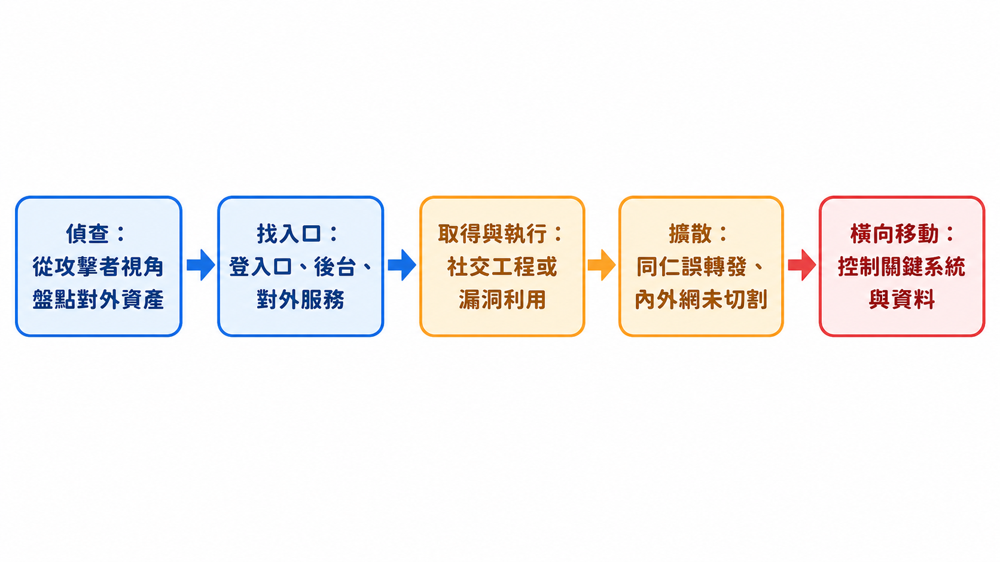
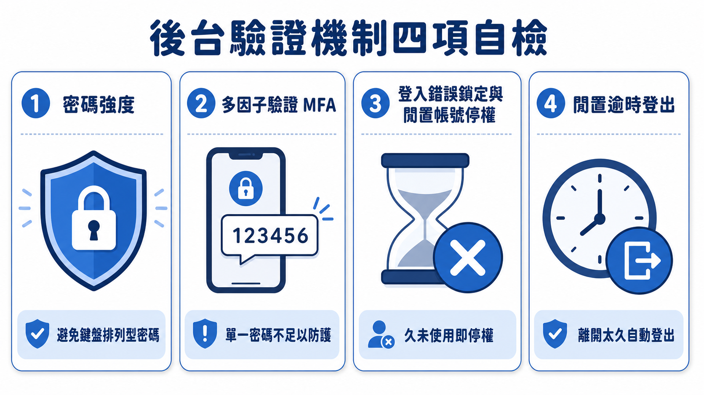
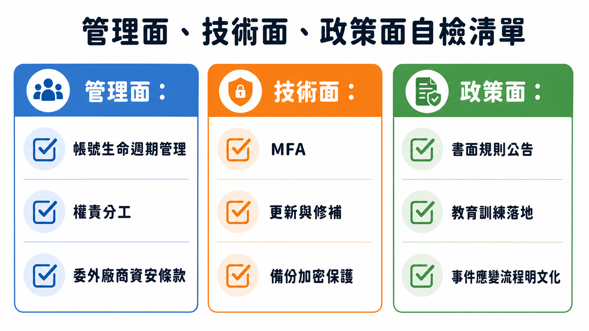

# 站在攻擊者那一邊看自己的公司：三甲科技魏國銳總監的資安實戰筆記

> **課程定位**：Day2 標竿學習企業講座，由三甲科技營運總監魏國銳（逢甲大學資訊工程學系兼課教師）以檢測型資安服務業者的第一線經驗，分享中小企業該如何從攻擊者視角盤點自己的暴露面。

「我們公司很小，不會有人來攻擊我們。」這是魏國銳十年前創業時最常聽到的一句話。他的答案很直接：攻擊者根本不在乎你是不是台積電。勒索軟體撒出去的時候不會篩選客戶等級，補到幾隻魚就是幾隻魚；掃描工具鎖定的是某一套有漏洞的軟體，只要你剛好用了那套軟體，就會被掃到。規模從來不是防禦力，暴露面才是。

這正是這場分享要翻轉的思考順序。多數企業做資安，出發點是「由內而外」：我要買什麼設備、要符合什麼合規要求、要花多少預算。但預算和台積電比不了，這條路走到最後只會停在「別人做得比我嚴謹，但我沒有錢、沒有人、沒有時間」的無力感裡。魏國銳提出的做法是反過來：先站到攻擊者那一邊，看看自己從外面看起來是什麼樣子——哪裡有登入口、哪裡沒切乾淨、哪裡的資料其實早就外洩卻沒人知道。知道破口在哪裡，才談得上排優先順序。

## 摘要

> 本文整理三甲科技魏國銳總監以攻擊者視角出發的資安分享。核心觀念是：與其從「合規要求我做什麼」出發，不如先盤點自己對外暴露了哪些攻擊面（官網、後台、電子郵件、VPN、遠端連線、供應鏈串接），並用被害妄想症式的思考找出破口。文章整理了偵查到橫向移動的攻擊鏈邏輯、Wi-Fi 與內外網切割不良導致「方便攻擊者也方便」的真實案例、後台驗證機制該檢查的四個項目（密碼強度、MFA、登入失敗鎖定、閒置帳號停權與逾時登出），以及兩個社交工程演練實例——管理部同仁誤點釣魚郵件後轉發給全公司、Outlook 預覽壓縮檔內 PDF 導致病毒在未點擊確認的情況下已執行三次。最後說明魏國銳建議的三階段排序：先止血、再打底、後求精進，並提出管理面、技術面、政策面三軸的自檢清單。

## 為什麼要談「攻擊面」：方便你的東西，也方便攻擊者

魏國銳把公司名稱取為三甲（Triple A），對應的正是資安裡最基本的三件事：認證（Authentication）、授權（Authorization）、記錄（Accounting）——先確認你是誰，才能決定你能做什麼，並且留下軌跡。這個命題聽起來抽象,但他用一個中部客戶的真實案例讓它變得具體。

那間公司的總經理很想把資安落地，也請三甲去做檢測。魏國銳看完後跟總經理說「體質要調很多」，其中一項是：訪客只要連上公司的訪客 Wi-Fi，就能碰到控制權限，因為內外網從來沒有切割過。董事長後來進來旁聽,劈頭就問「為什麼要做資安，你可以算 ROI 給我嗎？」魏國銳沒有算 ROI，而是直接示範了一次攻擊者視角：「你們家 Wi-Fi 密碼是共用的沒錯，因為要給客戶用，這沒問題。但這組 Wi-Fi 可以連到機房、可以控制產線,你今天可以讓整條產線斷線,不用上班了。」

這句話點出了整場分享最核心的邏輯：資訊化把所有系統串在一起，對員工來說很方便，同一套邏輯下，對攻擊者來說也一樣方便。你能從內網一台同仁的電腦連到公共區,攻擊者也可以。所以真正該問的不是「我的公司有沒有價值被攻擊」,而是「我暴露在外面的東西,攻擊者能碰到多深」。

魏國銳也澄清了一個常見誤解：攻擊未必是針對性的。很多時候不是攻擊者特別討厭某間公司，而是掃描工具發現某套軟體有漏洞，就對所有用這套軟體的對象全部掃過一輪。企業暴露在外面的服務,不需要被「盯上」，只要被「掃到」就可能中招。這也解釋了為什麼即便是完全內網作業（他分享過一家業務全部用 Gmail 收信、單子重新 Key 進內網系統的企業，寧可重工也要物理隔離）的極端案例仍然罕見——多數企業終究得對外開放郵件、官網、供應鏈介接，攻擊面無法完全歸零，只能盤點與管理。

## 攻擊者怎麼看你的公司：從偵查到橫向移動

魏國銳把攻擊者的操作邏輯拆成一條鏈：從外部視角偵查企業對外暴露了什麼，找到可以進入的入口，透過社交工程或漏洞取得執行權限，再想辦法擴散到整個組織，最後橫向移動、控制關鍵系統或資料。這條鏈的每一步，都對應企業防禦時該檢查的位置。

<figure class="infographic">
<picture>
<source media="(max-width: 760px)" srcset="images/03_attack-chain-mobile.png">

</picture>
<figcaption>從偵查到橫向移動，每一個攻擊階段都是企業可以設防與查核的位置</figcaption>
</figure>

**偵查階段**，攻擊者做的事情跟一般人查資料沒有兩樣，差別只在於目的不同：一般人用搜尋引擎找答案，攻擊者是想知道你「全部」暴露了什麼。企業常有的盲點是，資訊管理人員自己都不清楚公司到底對外開了哪些系統——魏國銳提到，檢測時做拓撲掃描,常常會發現連負責資安的同仁都不知道存在的服務。這一類偵查手法（例如透過關鍵字搜尋找出企業未預期暴露的登入介面或管理後台）之所以有效，正是因為企業自己沒有先盤點好對外資產；防禦重點不在於試圖阻止所有搜尋行為，而在於企業要主動盤點、關閉不必要的對外服務，並定期檢查是否有非預期開放的系統。

**找入口之後**，攻擊者要嘛靠社交工程騙到帳密或執行權限，要嘛利用系統漏洞直接取得存取。魏國銳特別提醒，很多企業的資安管理機制背後其實都有具體理由——例如系統不該同時告訴使用者「帳號不存在」或「密碼錯誤」，因為只要區分兩種錯誤訊息，攻擊者就能反覆試探確認哪些帳號真實存在,進而集中火力去猜測密碼。這類細節看起來像吹毛求疵，實際上是在堵住一個可以被自動化放大的漏洞。

**取得執行權限後**，風險不會停在一台電腦。魏國銳反覆強調，很多攻擊面向的問題不在於技術多深，而在於企業自己沒有把最基本的東西顧好：弱密碼、忘記更新的防火牆版本、沒設密碼的掃描設備分享資料夾。他也提到一個容易被忽略的心理陷阱——「大門關起來就沒事」是錯的,因為攻擊者可能已經在你關上門之前就進到門內,事後止血遠比想像中困難。

## 後台驗證機制：四個容易被忽略卻決定成敗的開關

魏國銳提供了一份簡易自檢清單，核心是先確認企業對自己的對外服務與後台驗證機制有沒有基本掌握。他特別點出四個經常被忽略、卻直接決定攻擊難度的機制：

- **密碼強度**：他分享檢測經驗中最常見的破口仍然是弱密碼——不是簡單如 123456，而是鍵盤排列型密碼（例如沿著鍵盤某一排加大小寫與符號組成的字串），這類密碼即使符合「八碼、含大小寫、含符號、含數字」的規則要求，仍然極容易被猜到，因為它的規律性來自鍵盤位置而非隨機性。
- **多因子驗證（MFA）**：他坦言很多企業知道 MFA 重要，卻卡在沒錢、沒時間、機制還沒盤點好而遲遲無法導入,這是課程裡刻意保留、要讓企業自己回去排優先順序的現實問題。
- **登入錯誤鎖定與帳號停權**：多次登入失敗要有鎖定機制，長期未使用的帳號要停權，這兩項如果沒做，等於幫攻擊者留了一扇沒有人在看守的側門。
- **閒置逾時登出**：系統若沒有設定閒置一段時間自動登出，加上瀏覽器記住密碼、永遠保持登入狀態，攻擊者一旦取得裝置存取權，等於直接繼承了合法使用者的整個工作階段（Session）。

魏國銳用一段簡短的示範影片說明了 Session 被竊取後的實際後果：一個留言板上的連結被同仁點擊後，攻擊者透過已知的網站弱點，取得了該同仁登入時產生的 Session 識別碼，並用這組識別碼複寫自己的瀏覽器狀態，直接冒充成該同仁登入系統——過程中完全不需要知道對方的帳號密碼。這說明了驗證機制不能只看「有沒有密碼」，登入之後的身分維持機制同樣是攻擊面的一部分。

<figure class="infographic">
<picture>
<source media="(max-width: 760px)" srcset="images/03_backend-auth-check-mobile.png">

</picture>
<figcaption>後台安全不只看密碼，還要同時檢查 MFA、帳號停權與逾時登出</figcaption>
</figure>

## 社交工程演練：兩個看似荒謬、卻真實發生的案例

魏國銳認為，不論企業在技術面投入多少資源，社交工程始終是最容易讓整條防線失守的一環——因為它攻擊的不是系統,而是人的信任與習慣。他分享了兩個在企業演練與事件處理中遇到的真實案例。

第一個案例發生在一次企業內部的社交工程演練中。管理部門設計了一封以「公司新聞」為主題的模擬演練信寄給全公司，用意是測試同仁是否會點擊可疑連結。結果負責這場演練的管理部同仁自己點開了信件、仔細看完內容之後，覺得內容不錯，還主動把這封信轉發給了全公司所有人。魏國銳的評論很直白：如果那真的是一支病毒，散播它的人反而是最盡責檢查郵件的那一位——「你自己很開心，大家會跟著你一起開心。」這個案例點出社交工程防禦最脆弱的環節不是「不小心點擊」，而是連負責把關的人都可能在善意驅動下把風險擴大。

第二個案例是一次真實的資安事件應變。一台公司電腦被勒索軟體加密，第一時間的處置是斷網止血。同仁一開始被詢問時表示自己最近沒有下載可疑檔案、沒有安裝什麼軟體、也沒有執行任何東西——這個回答並非說謊，因為就同仁自己的操作認知而言，他確實沒有「主動」點開任何東西。事後調查發現，可疑郵件裡有一個壓縮檔，同仁用 Outlook 預覽功能點開查看裡面的 PDF 檔案,點了兩下卻沒有反應,便放棄不理會了。但電腦在背景執行預覽時，其實已經自動完成了下載、解壓縮、開啟再刪除暫存檔的完整流程——換句話說，病毒在同仁認為「什麼都沒發生」的情況下，已經被執行了三次。更棘手的是，這位同仁事後把這封可疑郵件轉寄給了所有業務同仁，理由是「這是業務該處理的」，導致管理部門必須緊急聯絡所有業務同仁攔截郵件、並請郵件伺服器管理者封鎖信件。

這兩個案例共同指向同一個結論：社交工程演練與資安意識訓練，不能只停留在「教大家不要亂點」的層次。真正有效的教育,是讓同仁理解「看起來沒反應」不代表「什麼都沒發生」，以及一個人的誤判為什麼會迅速變成全公司的風險——這正是魏國銳強調「認知宣導」必須落地成具體規則、而不能只靠常識默契的原因：「你沒有寫下來的文字不叫 common sense，你的 sense 跟我的 sense 不一樣。」

## 從管理面、技術面到政策面：把單點知識排出行動順序

魏國銳提醒，這兩天課程已經涵蓋了大量單點的技術與管理知識，企業真正需要做的是把這些單點串成一條屬於自己的路徑（roadmap）。他建議的排序邏輯分成三個階段：

1. **止血**：把能立即處理、風險最高的破口先關掉，例如已知暴露的對外服務、共用密碼、已離職卻未停權的帳號。
2. **打底**：調整體質，補齊管理制度與基礎設定，例如落實更新、建立資產清冊、規劃帳號生命週期管理。
3. **求精進**：在前兩階段穩固之後，才進一步導入更成熟的防護機制與持續性監控。

他也提醒不能直接跳到第三階段——很多高階主管會希望一步到位導入最先進的防護，但如果連基本的資產盤點與帳號管理都沒有做好,再多的預算也堆不出真正的防禦力。

<figure class="infographic">
<picture>
<source media="(max-width: 760px)" srcset="images/03_three-axis-checklist-mobile.png">

</picture>
<figcaption>管理、技術與政策三軸要一起落地，單點工具無法代替完整治理</figcaption>
</figure>

## 結論

魏國銳這場分享的核心主張很單純：資安投入不該從「別人做得多嚴謹、我也要做到那樣」出發，而該從「攻擊者能碰到我哪裡」出發。無論是 Wi-Fi 沒切割導致訪客直通產線控制權、後台驗證機制沒有基本的密碼強度與逾時登出設定，還是社交工程演練裡負責把關的人反而擴大了風險——這些案例背後的共通點，都是企業把「內部方便」和「外部安全」混為一談,而攻擊者正好利用了這種方便。

檢測不需要追求台積電等級的嚴謹，而是要先誠實盤點自己真正該保護的東西是什麼、暴露在外面的有哪些，再依照止血、打底、求精進的順序排出行動優先順序。管理面、技術面、政策面三軸自檢清單，正是把這些分散的單點知識收斂成企業可以帶回去執行的第一步。

---

## 名詞速查

| 名詞 | 說明 |
| --- | --- |
| 攻擊面（Attack Surface） | 企業所有可能被攻擊者接觸、進入或利用的對外暴露點，包括官網、後台、電子郵件、VPN、遠端連線、供應鏈介接等。 |
| 白帽駭客 | 經過合法授權後進行攻擊測試的資安從業人員，目的是找出弱點以協助修補，而非造成實際傷害。 |
| MFA（多因子驗證） | 除密碼外再加一層驗證（如手機驗證碼、驗證 App）的登入機制，降低單一密碼外洩後被冒用的風險。 |
| Session（工作階段/網路身分證） | 使用者登入系統後,系統用來識別其身分的暫時性憑證；一旦被竊取，攻擊者無需帳密即可冒充該使用者。 |
| 社交工程 | 透過欺騙、偽裝或心理操弄取得受害者信任，藉此騙取帳密、誘導點擊惡意內容或執行特定行為的攻擊手法。 |
| 橫向移動 | 攻擊者取得初始立足點後，在企業內部網路中進一步擴散、控制更多系統與資料的階段。 |
| 資安衛生（Cyber Hygiene，延伸概念） | 強調資安需要持續性的檢查與維護，而非一次性專案即可永久解決。 |

## 來源與閱讀說明

- 完整逐字稿：[HackMD 課程逐字稿（下午）](https://hackmd.io/@lanss/BJdeF0ONGl)

本文依課程逐字稿整理魏國銳總監的分享內容，重組敘事順序並集中相關概念，技術操作細節僅保留防禦與風險意識層面的說明，不構成入侵操作教學。案例中的企業名稱、產業與具體識別資訊已依講者原意隱去。
