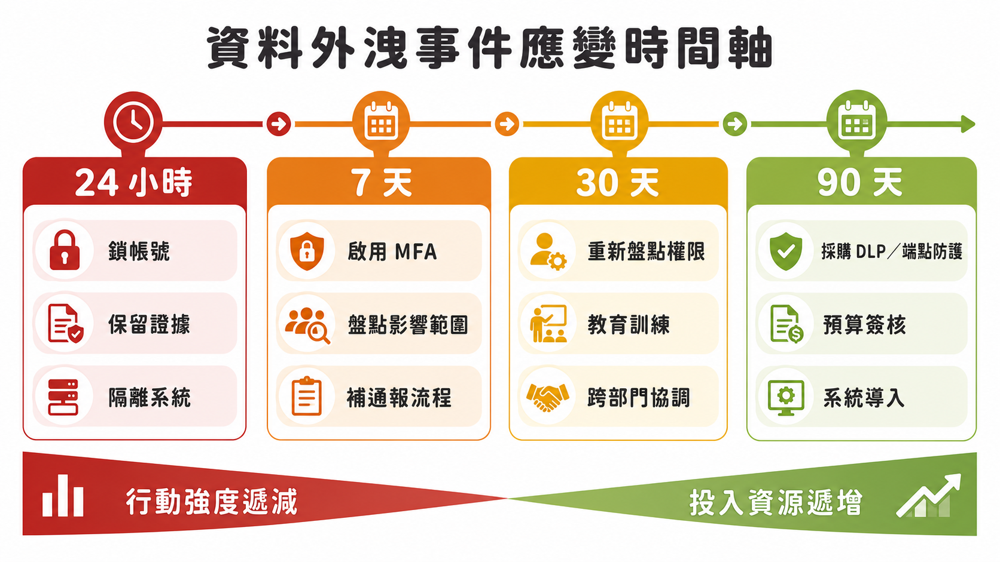

# 資料外洩發生後，企業第一天到第九十天該做什麼

> **課程定位**：Day2 情境模擬實作，由鄭郁翰副主任（崑山科技大學電腦與遊戲發展科學學士學位學程）帶領學員分組討論資料外洩情境，並統整成一套事件應變的分級處理邏輯。

多數企業第一次認真思考「資料外洩之後怎麼辦」，往往是在事情已經發生的當下——一封寄錯的信、一支不見的筆電、一個被冒用的雲端帳號。這時候最缺的不是道德譴責，而是一份能馬上照著做的行動順序。

鄭郁翰在這段課程安排的分組討論，讓學員從各種資料外洩情境出發，練習回答三個問題：這個情境會造成哪些風險？發生當下該立刻做什麼？未來要用什麼節奏改善，才不會再遇到同樣的問題。討論本身聚焦在具體案例的推演，但收斂出來的，是一套可以套用在任何資料外洩事件上的分級應變架構。

這份架構的核心只有兩件事：**用時間分級控制行動的優先順序**，以及**接受風險永遠無法歸零，但要把它壓在可接受的範圍**。以下把這套邏輯整理成企業可以直接參考的應變指南。

## 摘要

> 本文整理課程「資料外洩情境模擬」討論收斂出的事件應變邏輯：把處理節奏分成 24 小時緊急止血、7 天短期迅速處理、30 天中期制度補強、90 天長期投資規劃四個階段，越前面的階段越要求快、便宜、能立刻執行，越後面的階段才涉及預算與跨部門制度。文章也說明為什麼「止血」與「補漏洞」要分開思考，並整理風險處理最終會停在「剩餘風險（殘餘風險）」這個概念——目標不是把風險歸零，而是把它壓在企業可以接受的範圍內。

## 為什麼要先分級，而不是想到什麼做什麼

資料外洩事件發生時，管理者常見的反應是同時想解決所有問題：鎖帳號、查證據、開會、通知客戶、順便把整體制度重新設計一遍。這種齊頭並進的做法在中小企業特別容易卡關，因為多數改善措施需要預算，而預算需要走簽核流程，不可能在事件發生的當下一次到位。

課程強調的分級邏輯，把應變拆成四個時間窗，越前面越要求「不花錢、能馬上做」，越後面才容許涉及採購與制度變動：

- **24 小時：緊急止血。** 目標只有一個——先讓災情不再擴大。這個階段做的是鎖帳號、改密碼、撤除異常登入、隔離受影響系統、保留證據，不是把整體防護機制重新設計一遍。
- **7 天：短期迅速處理。** 找能夠快速到位、成本低、不需要大規模採購的改善項目，例如全面啟用 MFA、盤點受影響範圍、補齊通報流程的缺口。
- **30 天：中期制度補強。** 涉及跨部門溝通與教育訓練，例如重新盤點權限、建立離職通報機制、擴大檢查覆蓋範圍，這類事需要開會協調，但不一定要花大錢。
- **90 天：長期投資規劃。** 需要採購設備或系統（例如 DLP、進階端點防護），必須向管理層報告預算，時程也可能因為採購與導入流程而拉得比 90 天更長。

<svg id="my-svg" width="100%" xmlns="http://www.w3.org/2000/svg" xmlns:xlink="http://www.w3.org/1999/xlink" class="flowchart" style="max-width: 758px; background-color: transparent;" viewBox="0 0 758 94" role="graphics-document document" aria-roledescription="flowchart-v2"><g><marker id="my-svg_flowchart-v2-pointEnd" class="marker flowchart-v2" viewBox="0 0 10 10" refX="5" refY="5" markerUnits="userSpaceOnUse" markerWidth="8" markerHeight="8" orient="auto"><path d="M 0 0 L 10 5 L 0 10 z" class="arrowMarkerPath" style="stroke-width: 1; stroke-dasharray: 1, 0;"/></marker><marker id="my-svg_flowchart-v2-pointStart" class="marker flowchart-v2" viewBox="0 0 10 10" refX="4.5" refY="5" markerUnits="userSpaceOnUse" markerWidth="8" markerHeight="8" orient="auto"><path d="M 0 5 L 10 10 L 10 0 z" class="arrowMarkerPath" style="stroke-width: 1; stroke-dasharray: 1, 0;"/></marker><marker id="my-svg_flowchart-v2-circleEnd" class="marker flowchart-v2" viewBox="0 0 10 10" refX="11" refY="5" markerUnits="userSpaceOnUse" markerWidth="11" markerHeight="11" orient="auto"><circle cx="5" cy="5" r="5" class="arrowMarkerPath" style="stroke-width: 1; stroke-dasharray: 1, 0;"/></marker><marker id="my-svg_flowchart-v2-circleStart" class="marker flowchart-v2" viewBox="0 0 10 10" refX="-1" refY="5" markerUnits="userSpaceOnUse" markerWidth="11" markerHeight="11" orient="auto"><circle cx="5" cy="5" r="5" class="arrowMarkerPath" style="stroke-width: 1; stroke-dasharray: 1, 0;"/></marker><marker id="my-svg_flowchart-v2-crossEnd" class="marker cross flowchart-v2" viewBox="0 0 11 11" refX="12" refY="5.2" markerUnits="userSpaceOnUse" markerWidth="11" markerHeight="11" orient="auto"><path d="M 1,1 l 9,9 M 10,1 l -9,9" class="arrowMarkerPath" style="stroke-width: 2; stroke-dasharray: 1, 0;"/></marker><marker id="my-svg_flowchart-v2-crossStart" class="marker cross flowchart-v2" viewBox="0 0 11 11" refX="-1" refY="5.2" markerUnits="userSpaceOnUse" markerWidth="11" markerHeight="11" orient="auto"><path d="M 1,1 l 9,9 M 10,1 l -9,9" class="arrowMarkerPath" style="stroke-width: 2; stroke-dasharray: 1, 0;"/></marker><g class="root"><g class="clusters"/><g class="edgePaths"><path d="M132,47L136.167,47C140.333,47,148.667,47,156.333,47C164,47,171,47,174.5,47L178,47" id="L_a_b_0" class="edge-thickness-normal edge-pattern-solid edge-thickness-normal edge-pattern-solid flowchart-link" style=";" data-edge="true" data-et="edge" data-id="L_a_b_0" data-points="W3sieCI6MTMyLCJ5Ijo0N30seyJ4IjoxNTcsInkiOjQ3fSx7IngiOjE4MiwieSI6NDd9XQ==" marker-end="url(#my-svg_flowchart-v2-pointEnd)"/><path d="M338,47L342.167,47C346.333,47,354.667,47,362.333,47C370,47,377,47,380.5,47L384,47" id="L_b_c_0" class="edge-thickness-normal edge-pattern-solid edge-thickness-normal edge-pattern-solid flowchart-link" style=";" data-edge="true" data-et="edge" data-id="L_b_c_0" data-points="W3sieCI6MzM4LCJ5Ijo0N30seyJ4IjozNjMsInkiOjQ3fSx7IngiOjM4OCwieSI6NDd9XQ==" marker-end="url(#my-svg_flowchart-v2-pointEnd)"/><path d="M544,47L548.167,47C552.333,47,560.667,47,568.333,47C576,47,583,47,586.5,47L590,47" id="L_c_d_0" class="edge-thickness-normal edge-pattern-solid edge-thickness-normal edge-pattern-solid flowchart-link" style=";" data-edge="true" data-et="edge" data-id="L_c_d_0" data-points="W3sieCI6NTQ0LCJ5Ijo0N30seyJ4Ijo1NjksInkiOjQ3fSx7IngiOjU5NCwieSI6NDd9XQ==" marker-end="url(#my-svg_flowchart-v2-pointEnd)"/></g><g class="edgeLabels"><g class="edgeLabel"><g class="label" data-id="L_a_b_0" transform="translate(0, 0)"><foreignObject width="0" height="0">

</foreignObject></g></g><g class="edgeLabel"><g class="label" data-id="L_b_c_0" transform="translate(0, 0)"><foreignObject width="0" height="0">

</foreignObject></g></g><g class="edgeLabel"><g class="label" data-id="L_c_d_0" transform="translate(0, 0)"><foreignObject width="0" height="0">

</foreignObject></g></g></g><g class="nodes"><g class="node default urgent" id="flowchart-a-0" transform="translate(70, 47)"><rect class="basic label-container" style="fill:#FEE2E2 !important;stroke:#B91C1C !important;stroke-width:2px !important" x="-62" y="-39" width="124" height="78"/><g class="label" style="color:#7F1D1D !important" transform="translate(-32, -24)"><rect/><foreignObject width="64" height="48">

24 小時 緊急止血

</foreignObject></g></g><g class="node default short" id="flowchart-b-1" transform="translate(260, 47)"><rect class="basic label-container" style="fill:#FEF3C7 !important;stroke:#D97706 !important;stroke-width:2px !important" x="-78" y="-39" width="156" height="78"/><g class="label" style="color:#78350F !important" transform="translate(-48, -24)"><rect/><foreignObject width="96" height="48">

7 天 短期迅速處理

</foreignObject></g></g><g class="node default mid" id="flowchart-c-3" transform="translate(466, 47)"><rect class="basic label-container" style="fill:#DBEAFE !important;stroke:#1D4ED8 !important;stroke-width:2px !important" x="-78" y="-39" width="156" height="78"/><g class="label" style="color:#172554 !important" transform="translate(-48, -24)"><rect/><foreignObject width="96" height="48">

30 天 中期制度補強

</foreignObject></g></g><g class="node default long" id="flowchart-d-5" transform="translate(672, 47)"><rect class="basic label-container" style="fill:#DCFCE7 !important;stroke:#15803D !important;stroke-width:2px !important" x="-78" y="-39" width="156" height="78"/><g class="label" style="color:#14532D !important" transform="translate(-48, -24)"><rect/><foreignObject width="96" height="48">

90 天 長期投資規劃

</foreignObject></g></g></g></g></g></svg>

<svg id="my-svg" width="100%" xmlns="http://www.w3.org/2000/svg" xmlns:xlink="http://www.w3.org/1999/xlink" class="flowchart" style="max-width: 172px; background-color: transparent;" viewBox="0 0 172 478" role="graphics-document document" aria-roledescription="flowchart-v2"><g><marker id="my-svg_flowchart-v2-pointEnd" class="marker flowchart-v2" viewBox="0 0 10 10" refX="5" refY="5" markerUnits="userSpaceOnUse" markerWidth="8" markerHeight="8" orient="auto"><path d="M 0 0 L 10 5 L 0 10 z" class="arrowMarkerPath" style="stroke-width: 1; stroke-dasharray: 1, 0;"/></marker><marker id="my-svg_flowchart-v2-pointStart" class="marker flowchart-v2" viewBox="0 0 10 10" refX="4.5" refY="5" markerUnits="userSpaceOnUse" markerWidth="8" markerHeight="8" orient="auto"><path d="M 0 5 L 10 10 L 10 0 z" class="arrowMarkerPath" style="stroke-width: 1; stroke-dasharray: 1, 0;"/></marker><marker id="my-svg_flowchart-v2-circleEnd" class="marker flowchart-v2" viewBox="0 0 10 10" refX="11" refY="5" markerUnits="userSpaceOnUse" markerWidth="11" markerHeight="11" orient="auto"><circle cx="5" cy="5" r="5" class="arrowMarkerPath" style="stroke-width: 1; stroke-dasharray: 1, 0;"/></marker><marker id="my-svg_flowchart-v2-circleStart" class="marker flowchart-v2" viewBox="0 0 10 10" refX="-1" refY="5" markerUnits="userSpaceOnUse" markerWidth="11" markerHeight="11" orient="auto"><circle cx="5" cy="5" r="5" class="arrowMarkerPath" style="stroke-width: 1; stroke-dasharray: 1, 0;"/></marker><marker id="my-svg_flowchart-v2-crossEnd" class="marker cross flowchart-v2" viewBox="0 0 11 11" refX="12" refY="5.2" markerUnits="userSpaceOnUse" markerWidth="11" markerHeight="11" orient="auto"><path d="M 1,1 l 9,9 M 10,1 l -9,9" class="arrowMarkerPath" style="stroke-width: 2; stroke-dasharray: 1, 0;"/></marker><marker id="my-svg_flowchart-v2-crossStart" class="marker cross flowchart-v2" viewBox="0 0 11 11" refX="-1" refY="5.2" markerUnits="userSpaceOnUse" markerWidth="11" markerHeight="11" orient="auto"><path d="M 1,1 l 9,9 M 10,1 l -9,9" class="arrowMarkerPath" style="stroke-width: 2; stroke-dasharray: 1, 0;"/></marker><g class="root"><g class="clusters"/><g class="edgePaths"><path d="M86,86L86,90.167C86,94.333,86,102.667,86,110.333C86,118,86,125,86,128.5L86,132" id="L_a_b_0" class="edge-thickness-normal edge-pattern-solid edge-thickness-normal edge-pattern-solid flowchart-link" style=";" data-edge="true" data-et="edge" data-id="L_a_b_0" data-points="W3sieCI6ODYsInkiOjg2fSx7IngiOjg2LCJ5IjoxMTF9LHsieCI6ODYsInkiOjEzNn1d" marker-end="url(#my-svg_flowchart-v2-pointEnd)"/><path d="M86,214L86,218.167C86,222.333,86,230.667,86,238.333C86,246,86,253,86,256.5L86,260" id="L_b_c_0" class="edge-thickness-normal edge-pattern-solid edge-thickness-normal edge-pattern-solid flowchart-link" style=";" data-edge="true" data-et="edge" data-id="L_b_c_0" data-points="W3sieCI6ODYsInkiOjIxNH0seyJ4Ijo4NiwieSI6MjM5fSx7IngiOjg2LCJ5IjoyNjR9XQ==" marker-end="url(#my-svg_flowchart-v2-pointEnd)"/><path d="M86,342L86,346.167C86,350.333,86,358.667,86,366.333C86,374,86,381,86,384.5L86,388" id="L_c_d_0" class="edge-thickness-normal edge-pattern-solid edge-thickness-normal edge-pattern-solid flowchart-link" style=";" data-edge="true" data-et="edge" data-id="L_c_d_0" data-points="W3sieCI6ODYsInkiOjM0Mn0seyJ4Ijo4NiwieSI6MzY3fSx7IngiOjg2LCJ5IjozOTJ9XQ==" marker-end="url(#my-svg_flowchart-v2-pointEnd)"/></g><g class="edgeLabels"><g class="edgeLabel"><g class="label" data-id="L_a_b_0" transform="translate(0, 0)"><foreignObject width="0" height="0">

</foreignObject></g></g><g class="edgeLabel"><g class="label" data-id="L_b_c_0" transform="translate(0, 0)"><foreignObject width="0" height="0">

</foreignObject></g></g><g class="edgeLabel"><g class="label" data-id="L_c_d_0" transform="translate(0, 0)"><foreignObject width="0" height="0">

</foreignObject></g></g></g><g class="nodes"><g class="node default urgent" id="flowchart-a-0" transform="translate(86, 47)"><rect class="basic label-container" style="fill:#FEE2E2 !important;stroke:#B91C1C !important;stroke-width:2px !important" x="-62" y="-39" width="124" height="78"/><g class="label" style="color:#7F1D1D !important" transform="translate(-32, -24)"><rect/><foreignObject width="64" height="48">

24 小時 緊急止血

</foreignObject></g></g><g class="node default short" id="flowchart-b-1" transform="translate(86, 175)"><rect class="basic label-container" style="fill:#FEF3C7 !important;stroke:#D97706 !important;stroke-width:2px !important" x="-78" y="-39" width="156" height="78"/><g class="label" style="color:#78350F !important" transform="translate(-48, -24)"><rect/><foreignObject width="96" height="48">

7 天 短期迅速處理

</foreignObject></g></g><g class="node default mid" id="flowchart-c-3" transform="translate(86, 303)"><rect class="basic label-container" style="fill:#DBEAFE !important;stroke:#1D4ED8 !important;stroke-width:2px !important" x="-78" y="-39" width="156" height="78"/><g class="label" style="color:#172554 !important" transform="translate(-48, -24)"><rect/><foreignObject width="96" height="48">

30 天 中期制度補強

</foreignObject></g></g><g class="node default long" id="flowchart-d-5" transform="translate(86, 431)"><rect class="basic label-container" style="fill:#DCFCE7 !important;stroke:#15803D !important;stroke-width:2px !important" x="-78" y="-39" width="156" height="78"/><g class="label" style="color:#14532D !important" transform="translate(-48, -24)"><rect/><foreignObject width="96" height="48">

90 天 長期投資規劃

</foreignObject></g></g></g></g></g></svg>

圖：資料外洩事件應變的四階段分級處理流程，越前面越要求快、便宜、能立刻執行。

<figure class="infographic">
<picture>
<source media="(max-width: 760px)" srcset="images/04_response-timeline-mobile.png">

</picture>
<figcaption>越靠前越重視立即止血，越靠後越需要跨部門協調、預算與系統性投入</figcaption>
</figure>

## 24 小時：先止血，不是先解決問題

止血階段最容易犯的錯誤，是把它和後續的補強混在一起做。課程討論中反覆出現的做法包括：立即關閉受影響帳號的存取權限、重設密碼與登入憑證、撤除異常的登入狀態或信件轉寄規則、確認並隔離受影響範圍、保留可能需要的證據（例如系統 log），以及依法規或內部規定啟動通報。

這個階段的判斷原則很單純：能不能在極短時間內、不需要額外預算的情況下執行？如果答案是否定的，那件事就不屬於 24 小時該做的事，應該挪到後面的階段。討論中也提醒，止血的目的是控制範圍，不是追究責任——面對資料外洩，優先要務是把問題解決，而不是先花時間釐清是誰的錯。

## 7 天到 90 天：把改善拆成短、中、長期

止血之後，才是真正補漏洞的階段，而這裡同樣需要分級，理由是中小企業的資源有限，一次要求做完所有改善，等於什麼都做不完。

**7 天內**適合處理不涉及大筆預算、可以馬上執行的項目：全面啟用多因子驗證、盤點受影響的帳號與資料範圍、建立或補齊通報窗口。這個階段強調「迅速到位」，做法通常是調整既有工具的設定，而不是導入新系統。

**30 天內**適合處理需要跨部門溝通、但不一定花大錢的項目：重新檢視並調整權限分工、針對相關人員加開教育訓練、建立離職或角色異動時的帳號處理流程。這類事情牽涉到討論與共識，需要開會協調，時間自然拉得比 7 天長。

**90 天**才輪到需要採購與預算簽核的長期投資：導入 DLP（資料外洩防護）、強化端點防護、建立更完整的存取控管機制。課程也提醒，中小企業的採購流程往往比想像中慢，90 天只是一個原則性的分野，實務上可能需要規劃更長期的時程。

這種分級也解釋了為什麼「7 天內把帳號鎖起來」的做法會被視為時間拉得太長——鎖帳號、阻止資料繼續外流，屬於「立刻讓災情停止擴大」的止血動作，應該在 24 小時內完成；如果拖到 7 天才處理，資料可能早已不知道流向哪裡。分級的意義不在於機械套用天數，而在於分辨一件事屬於「止血」還是「補漏洞」。

## 剩餘風險：目標不是歸零，而是可接受

無論止血與補強做得多完整，風險處理到最後都會停在同一個概念：**剩餘風險**，也叫**殘餘風險**。風險不會因為做了控制措施就等於零，任何防護機制都有可能失效或被繞過。

因此，資料保護的目標不應該設定為「消除所有風險」，而是把剩餘風險控制在企業可以接受的範圍內。判斷一項風險是否可以接受，通常會看幾個面向：萬一真的發生，會不會危及人身安全、會不會違法、會不會造成企業無法承受的重大損失；如果評估下來後果可控，且企業已經有機制能讓損害不擴大、或能迅速恢復，這樣的風險就可以被列為可接受。至於如何具體評定風險等級、劃出可接受與不可接受的分界，屬於更完整的風險評估方法論，需要企業依自身狀況進一步發展，不是套一個公式就能得到答案。

這個概念也呼應了分級應變的邏輯本身：與其追求一次到位的完美防護，不如務實地依照時間與資源分階段推進，把風險逐步壓低到可以接受的水準。

## 結論

企業面對資料外洩，最實用的不是一份鉅細靡遺的防護清單，而是一套能在壓力下立刻執行的分級邏輯：24 小時先止血、7 天處理能快速到位的項目、30 天推動跨部門的制度補強、90 天規劃需要預算的長期投資。這個順序的關鍵在於分辨「止血」與「補漏洞」是兩件不同的事，止血求快求簡單，補漏洞才談制度與投資。

而所有這些努力最終要回到一個誠實的認知：風險不會歸零，剩餘風險永遠存在。企業能做的，是透過分級應變把剩餘風險控制在自己可以承受、可以迅速恢復的範圍內，而不是徒勞地追求一次性解決所有問題。

---

## 名詞速查

- **緊急止血**：事件發生後最優先的行動，目的是阻止災情擴大，例如鎖帳號、隔離系統、保留證據，而非立即解決根本問題。
- **短、中、長程計畫（7 天／30 天／90 天）**：依所需資源與協調複雜度分級的補強節奏，越後面的階段越可能涉及預算與跨部門制度調整。
- **剩餘風險（殘餘風險）**：任何控制措施都無法將風險降為零之後，仍然存在的風險。目標是將其控制在企業可接受的範圍內，而非徹底消除。
- **可接受風險**：評估後認為萬一發生也不會危及人身安全、不違法、不造成重大損失，且企業已有應變或復原機制的風險。

## 來源與閱讀說明

- 完整逐字稿：[HackMD 課程逐字稿（下午）](https://hackmd.io/@lanss/BJdeF0ONGl)

本文依課程逐字稿整理事件應變的分級邏輯與剩餘風險概念；課程原始分組討論的具體情境題目與範例答案，請以主辦單位提供的教材為準，本文不重製其內容。
